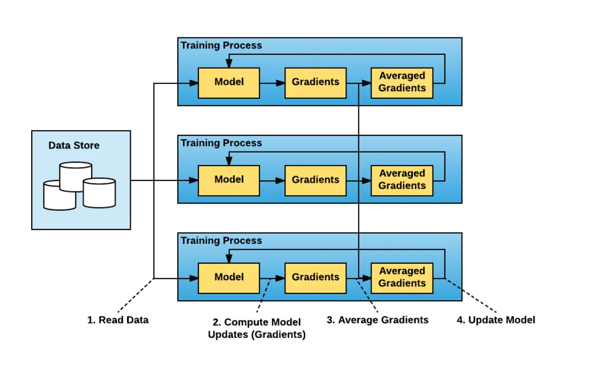
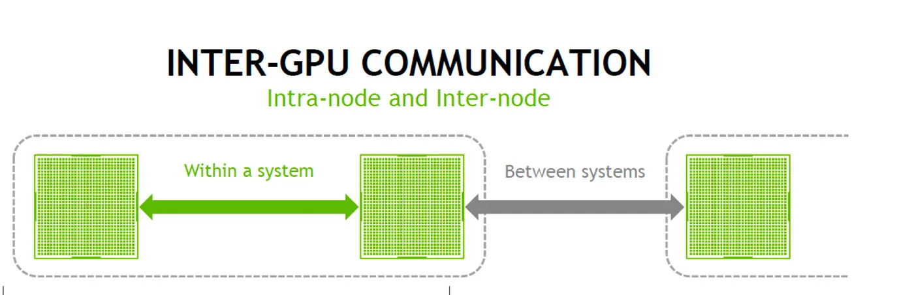
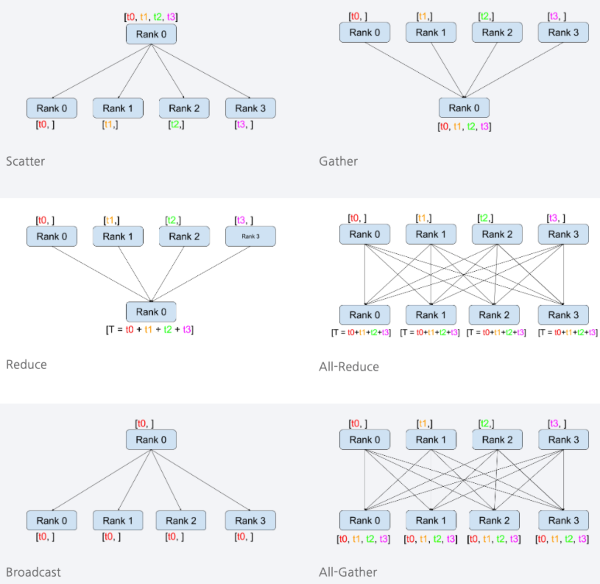
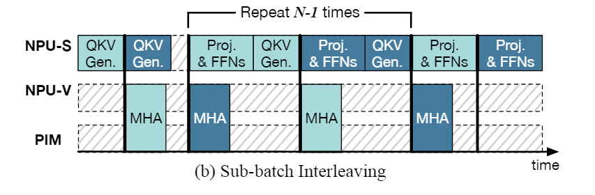
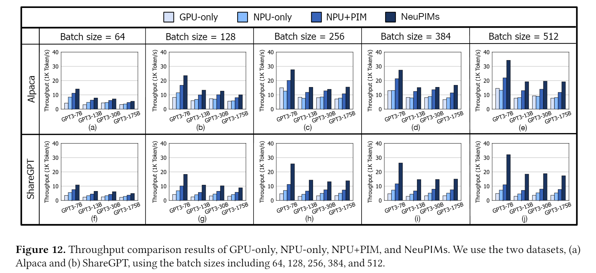
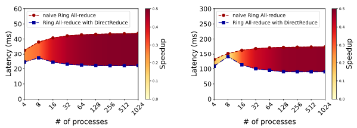
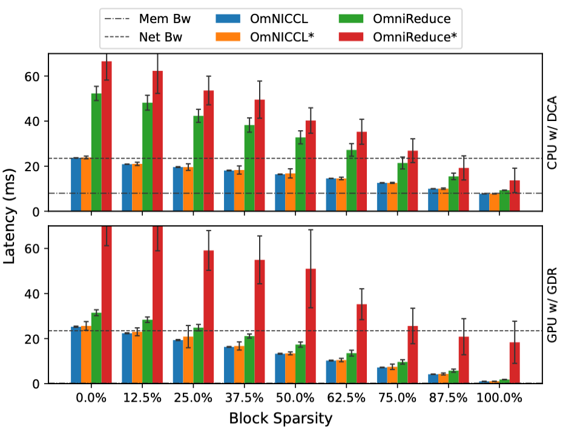

## Abstract
Our blog post will focus on optimizing the serving of large-scale language models in distributed systems, with an emphasis on improving memory efficiency and reducing latency.

#### System architecture aspect
Large Language Models (LLMs) have mostly been developed in the form of GPT, which is based on the Decoder phase of the Transformer. As the context length of an LLM increases, inference performance becomes highly dependent on the optimization of the Attention operation. Accordingly, LLMs such as GPT operate in two major stages: Prefill and Decoding, each with distinct computational characteristics. For example, during the Decoder phase, the initial tokens are summarized in the Prefill stage, and subsequently, batched requests each maintain their own KV Cache. The process of loading these caches introduces overhead, resulting in a memory bottleneck.   
In particular, the KV Cache grows with the sequence length and becomes a key source of memory bandwidth bottlenecks. **As the size of the prompt increases, the memory load during the Attention operation introduces** significant overhead in LLM serving. This blog, based on NeuPIMs and the paper PIM is All You Need, presents a new perspective that **computational characteristics such as GEMM and GEMV operations, as well as the layer structure, should be carefully segmented and treated with distinct batching strategies depending on the type of accelerator used.**

#### Network aspect
As deep learning models—including large language models (LLMs)—continue to grow in scale, it has become increasingly difficult to train them on a single GPU. This has led to a growing interest in **Distributed Deep Learning** (DDL), which enables models to be trained in parallel across multiple hardware devices. While DDL offers clear advantages in scalability, it also introduces a critical challenge: communication overhead between devices. In particular, **inter-node communication** (GPU-to-GPU) can be handled efficiently using high-performance communication libraries such as NVIDIA’s NCCL (NVIDIA Collective Communication Library). However, **intra-node communication** (between GPU systems) often relies on Ethernet-based connections, which are inherently limited by physical bandwidth and latency constraints.
To address these limitations, intelligent network interface cards (SmartNICs) have emerged as a promising solution<d-cite key="OmNICCL, DirectReduce, FPGANIC, OptimusNIC, SqueezeNIC"></d-cite>. In this blog post, we explore ***how recent research suggests that SmartNICs can be leveraged to optimize communication overhead between system nodes in distributed deep learning environments***.

In conclusion, this blog explores recent research on optimizing large language model (LLM) serving in large-scale server system from two key perspectives: **addressing memory bottlenecks through PIM/NDP-based architectural optimizations** and **reducing communication overhead using SmartNICs**. Through this dual approach, we aim to identify more efficient system architectures for LLM serving.

## Background
### GEMM & GEMV  
  - **GEMV** stands for "GEneral Matrix Vector multiplication," referring to a general operation between a matrix and a vector. When $\alpha=1$ and $\beta=0$, it denotes a standard matrix-vector multiplication:
  $$
  y=\alpha Ax+\beta y
  $$
  In general, GEMV has a time complexity of $O(n^2)$.

  - **GEMM** stands for "GEneral Matrix Matrix multiplication," referring to a general operation between two matrices. When $\alpha=1$ and $\beta=0$, it denotes a standard matrix-matrix multiplication:
  $$
  y=\alpha AB+\beta C
  $$
  In general, GEMM has a time complexity of $O(n^3)$.

### NDP, PIM  

Modern compute architectures are fundamentally based on the Von Neumann architecture. In the Von Neumann architecture, the Processing Unit (PU) and Memory are separated, and the computer architecture is organized such that the PU receives data from memory to perform computations. Accordingly, until a few years ago, previous works focused on enhancing the performance of each component by optimizing GPUs and TPUs to increase FLOPS, and improving memory to enable fast memory transfer to accelerators by increasing memory bandwidth.

However, despite advancements in accelerators, the emergence of AI has caused workloads to become increasingly data-intensive, leading to a situation where the memory bandwidth cannot keep up with the FLOPS of accelerators. In particular, for LLMs, the process of summarizing the initial prompt and generating one token at a time requires each request to load its own cache into the accelerator, resulting in significant bottlenecks during this process.

To address the issue where memory cannot keep up with the FLOPS of accelerators, techniques have been developed to process data stored in memory not in GPUs or NPUs, but using small accelerators placed close to the memory. These techniques can be classified into PIM (Processing-In-Memory) and NDP (Near-Data Processing) depending on whether the computation is performed inside the memory chip or in a controller outside the memory chip.

PIM performs computations by directly manipulating the sense amplifiers inside the DRAM chip. Compared to NDP, it provides higher bandwidth and thus enables faster computations, but being inside the chip, it has lower computational flexibility and primarily performs MAC (Multiplication-ACcumulation) operations.

NDP is typically located in the DRAM controller. Although it has lower bandwidth than PIM, it supports flexible data formats and performs general-purpose computations, offering a wide range of application possibilities.

| Item | PIM (Processing-In-Memory)| NDP (Near-Data Processing)|
|-|-|-|
|**Computation Speed**| 	Very fast (in-cell parallel bitwise operations)|Fast (general-purpose computation with reduced data movement)|
|**Flexibility**| 	Low (only specific operations, fixed circuits)| High (can use general-purpose ALU, SIMD)|
|**Main Computation Types**| 	Bitwise (AND, OR, NOT), MAC, simple comparisons |General-purpose operations such as sorting, filtering, DB joins, ML inference|
|**Location of Processing Unit**| Inside DRAM/Flash cells or near sense amplifiers| Next to memory modules, around DIMM or SSD controller|
|**Pros**| 	Eliminates data movement, ultra-fast computation, high bit-level parallelism| Versatility, supports complex operations, programmable structure|
|**Cons**| Limited operations, low circuit flexibility| 	Some data movement still exists between memory and processor|

### PIM/NDP & GPU/NPU Accelater Features

In the case of GEMM, the arithmetic intensity is high with a complexity of approximately $O(N^3)$, whereas GEMV has a lower operation intensity of around $O(N^2)$ and tends to operate in a memory-bound manner.
Therefore, GPUs and NPUs, which are optimized for high compute intensity, perform most efficiently with GEMM operations. In contrast, GEMV operations tend to be less efficient due to the relatively large overhead from synchronization and memory movement compared to the computational gain.

GPUs and NPUs operate more efficiently when the arithmetic intensity of GEMV is high. Thus, while they are well-suited for high-operation-intensity tasks like GEMM, they tend to show lower utilization for matrix-vector multiplications such as GEMV.

### Explanation of Detailed Operations in LLM Transformers, Multi-Head Attention, and GEMM/GEMV Computation
- transformer & GPT
  
  LLMs such as ChatGPT and Llama3 primarily follow the GPT architecture, which adopts only the decoding stack of the Transformer structure. A key characteristic of this architecture is that it generates one token per iteration during the token generation process.

  
- Difference Between the Prefill and Decoding Phases in the Decoding Stack
  
  The transformer structure in GPT primarily consists of a Decoding Stack, which is composed of Multi-Head Attention (MHA) blocks and Feed Forward blocks. Each of these blocks is made up of the following key layers:
  - MHA Block
    - QKV Generation: $$ Q = XW^Q,\ K = XW^K,\ V = XW^V $$
    Query, Key, and Value matrices are generated from the input embeddings.
    Typically, QKV are calculated in a fused manner using a combined weight matrix $$W_{[Q,K,V]}$$, then split into individual components.

    - Logit: $$ QK^T $$
      Attention scores (similarities) are computed via the dot product of Query and Key.

    - Softmax: $$ \alpha = \text{Softmax}(\frac{\text{Logit}}{\sqrt{d_k}}) $$
      The Logits are normalized to produce attention weight distributions over tokens.

    - Attend: $$ \text{Attention} = \alpha V $$
      The weighted sum of the Value vectors is computed using the attention weights.

    - Concat: $$ \text{Concat}([head_1, ..., head_h]) $$
      Attention outputs from multiple heads are concatenated into a single vector.

    - QKV Projection: $$ \text{Output} = \text{Concat}(...)W^O $$
      The concatenated output is linearly projected to match the input dimension for the next layer.

  - Feed Forward (FF) Block

    - Feed Forward 1: $$ Z = XW_1 + b_1 $$
    Applies the first linear transformation to each token.

    - GeLU Activation:
    $$ \text{GeLU}(x) = 0.5x \left(1 + \tanh\left[\sqrt{\frac{2}{\pi}}(x + 0.044715x^3)\right]\right) $$

    - Feed Forward 2: $$ \text{Output} = ZW_2 + b_2 $$
    Applies the second linear transformation to produce the final output.

  This sequence of layers is used in two distinct phases: the **Prefil**l phase, where the input prompt is processed and the first token is generated, and the **Decoding** phase, where one token is generated at a time until the <EOS> token. These phases are distinguished by their computational characteristics: Prefill is compute-bound, while Decoding is memory-bound.

### Distributed Deep Learning

As deep learning models continue to grow in size, it has become increasingly difficult to train large-scale models using only the memory and compute resources of a single GPU. One of the key approaches to overcoming this limitation is **Distributed Deep Learning** (DDL). DDL distributes model parameters or data across multiple GPUs or nodes, enabling parallel training. It is generally categorized into **Data Parallelism** and **Model Parallelism**<d-cite key="denneman2020multiGPU"></d-cite>.

   - **Data Parallelism** is a training method designed for scenarios where a large volume of data needs to be processed. It distributes the dataset across multiple GPUs, allowing each GPU to train the same model on a different subset of the data. However, since each GPU only updates the weights based on its local data, a **synchronization** step is required to aggregate and redistribute the updated weight parameters. This is where **Collective Communication** becomes essential, and as we will discuss later, it can lead to increased communication overhead—particularly in inter-node communication.
   - **Model Parallelism** is a training approach used when the model itself is too large to fit on a single GPU. In this method, the model is divided and distributed across multiple GPUs. There are two main techniques for implementing Model Parallelism: (1) **Tensor Parallelism** and (2) **Pipeline Parallelism**. Synchronization overhead also exists in Model Parallelism, and it tends to occur more frequently than in Data Parallelism. This is because the model is partitioned, requiring GPUs to synchronize their intermediate computation results during training.

   While Distributed Deep Learning enables faster training and the ability to handle larger models, it inherently requires a synchronization process, which introduces a new challenge: communication overhead between GPUs. As the size of the model and dataset continues to grow, requiring more GPU systems to work together, this communication overhead is expected to increase even further.

### Intra-node & Inter-node Communication

In distributed training, cooperation among multiple GPUs is essential, and this involves two levels of communication. **intra-node communication** refers to communication between GPUs within a single server, which can typically be handled efficiently using high-speed interconnects such as NVLink and libraries like NCCL. In contrast, **inter-node communication** refers to communication between GPUs across different servers, which usually takes place over networks such as Ethernet or InfiniBand. In this case, limitations in network bandwidth and latency can lead to performance degradation. As mentioned earlier, parameter synchronization—performed repeatedly during training—is a major source of GPU-to-GPU communication overhead, and this overhead tends to be more severe in inter-node communication.

### Collective Communication
In DDL, **Collective Communication** is essential for synchronizing model parameters and efficiently distributing or aggregating data. This refers to communication patterns that involve exchanging or combining data across multiple processes or GPUs. These patterns are typically categorized into several common types, as outlined below<d-cite key="wikiCollectiveOp"></d-cite>.   

* **1:N communication** pattern
    * Broadcast: Sends data from a single node to all other nodes.
	* Scatter: Splits data on one node into multiple parts and distributes them to other nodes.
	* Gather: Collects data from multiple nodes and aggregates it on a single node.
	* Reduce: Combines data from multiple nodes using a specified operation (e.g., sum) and delivers the result to a single node.
* **N:N communication** pattern
    * AllGather: Each node shares its data with all other nodes, resulting in every node holding the complete set of data.
    * AllReduce: Data from all nodes is combined using a specified operation (e.g., sum), and the result is distributed back to all nodes.

### SmartNIC
A **Network Interface Card** (NIC) is a hardware device used to connect a system to a network and enable communication. Traditional NICs are limited in functionality—they typically handle simple network-related operations or forward incoming packets to the host CPU. In contrast, a SmartNIC is an enhanced Ethernet device equipped with onboard processing cores, allowing it to support more general-purpose tasks. Recent research leveraging SmartNICs often focuses on offloading certain tasks from the host CPU, thereby reducing its workload and enabling more efficient communication.   
   
SmartNICs are generally classified into two types: on-path and off-path.
* **On-path SmartNICs** are designed with programmable NIC cores, allowing them to handle not only basic network operations but also various offloaded computations directly within the NIC itself. While this approach offers flexibility, it has potential drawbacks—heavy computational loads can delay network packet processing, and programming the NIC cores tends to be highly complex.
* **Off-path SmartNICs**, on the other hand, include separate compute cores that are distinct from the main NIC cores. This design allows offloaded tasks to be processed without interfering with network performance. Although there is some communication overhead when accessing memory and compute resources, off-path SmartNICs are generally more programmer-friendly. As a result, they are more commonly adopted in recent research.

In this blog, we will primarily focus on studies utilizing off-path SmartNICs and explore how they can be leveraged to address the communication challenges outlined earlier.

## NeuPIMs & PIM is ALL you NEED

> Prefill and Decoding from the Perspective of Actual Computation
- Prefill  
  During the prefill stage, LLM computations are primarily composed of matrix-matrix multiplications, i.e., GEMM operations.
  The input $X:[\text{N}{\text{prompt}}, d{\text{emb}}]$ is structured as a matrix, where $\text{N}{\text{prompt}}$ denotes the number of prompt tokens, and $d{\text{emb}}$ is the dimensionality of the embedding vector representing each token.
  - MHA Block
    - QKV Generation (GEMM):  
      $ W^Q, W^K, W^V : [\text{N}{\text{prompt}}, d{\text{emb}}] \times [d_{\text{emb}}, d_{\text{emb}}] = [\text{N}{\text{prompt}}, d{\text{emb}}]$
    - Attention :   
      For convenience, the Logit, Softmax, and Attend steps are collectively referred to as the attention process.
      Each head splits the $Q,  K, V$ matrices by $\frac{d_{\text{emb}}}{H}, (H = \text{number of heads})$ and processes its own attention in parallel
      The operation $O = \text{Softmax}\left(\frac{QK^T}{\sqrt{d_k}}\right)V$ is computed in the form of **GEMM** as follows:  
      $Q \times K^T \times V:  [N_{prompt}, \frac{d_{emb}}{H}]\times[\frac{d_{emb}}{H}, N_{prompt}] \times [N_{prompt}, \frac{d_{emb}}{H}]$
      ※ (Note: $\sqrt{d_k}$ is a scalar and is omitted in computation.)
    - Concat: $ \text{Concat}([head_1:[N_{prompt}, \frac{d_{emb}}{H}], ..., head_h:[N_{prompt}, \frac{d_{emb}}{H}]]) :[\text{N}_{prompt}, d_{emb}]$
  - FF Block
    - Feed Forward 1: $ Z = XW_1+ b_1  \text{ where, } XW_1:[\text{N}_{prompt}, d_{emb}]\times[d_{emb},4\times d_{emb}]$ is computed using GEMM.
    - GeLU: Simple scalar-wise multiplication and activation.
    - Feed Forward 2: $ \text{Output} = ZW_2 + b_2  \text{ where, } XW_2:[\text{N}_{prompt}, 4\times d_{emb}]\times[4\times d_{emb},d_{emb}]$ is also computed as GEMM.

    

- Deocding  
During the Decoding phase, each request reuses previously computed Key and Value matrices, which are stored in memory as KV Cache and concatenated back during computation. Since the Query corresponds to **only one newly generated token**, it exists in the form of a vector. As a result, the attention operation involves multiple GEMV computations along with heavy KV Cache memory loads, making this phase predominantly memory-bound.

  - MHA Block: Emphasis on **GEMV** operations increases
    - QKV Generation (GEMM): $XW_Q,\ XW_K,\ XW_V: [1, d_{\text{emb}}] \times [d_{\text{emb}}, d_{\text{emb}}]$ These are vector-matrix multiplications.
    For Key and Value, the previous KV Cache is loaded from memory and concatenated. The KV matrices have shape:  
    $K,V: [N_{prev}+1, d_{emb}]$   
    Although a single request may appear as a GEMV, multiple decoding requests share the same weights. Thus, in practice, this is processed as a GEMM with shape:  
    $[N_{batches}, d_{emb}] \times [d_{emb}, d_{emb}]$
    - Attention :  $Q \times K^T \times V:  [1, \frac{d_{emb}}{H}]\times[\frac{d_{emb}}{H}, N_{prev}+1] \times [N_{prev}+1, \frac{d_{emb}}{H}]$  
    This involves heavy KV Cache loading from memory, and the operation is typically memory-bound.
    - Concat: $ \text{Concat}([head_1:[1, \frac{d_{emb}}{H}], ..., head_h:[1, \frac{d_{emb}}{H}]]) :[1, d_{emb}]$
  - FF Block
    - Feed Forward 1:  $Z = XW_1+ b_1\text{ where, }XW_1:[1, d_{emb}]\times[d_{emb},4\times d_{emb}]$
    This is processed as a GEMV operation.
    - GeLU: A simple element-wise scalar operation.
    - Feed Forward 2:  
    $ \text{Output} = ZW_2 + b_2 \text{ where, } XW_2:[1, 4\times d_{emb}]\times[4\times d_{emb},d_{emb}]$  
     While each request individually resembles a GEMV, since all decoding requests share the same weights and the FF block is a linear operation, multiple requests can be batched and computed together. This results in a GEMM operation of the form:  
     $[N_{batches}, d_{emb}] \times [d_{emb}, 4\times d_{emb}] \times [4\times d_{emb}, d_{emb}]$

In summary, Prefill computations are predominantly in the form of GEMM operations. Since this is the initial stage, there is no prior KV Cache per request, allowing the operations to be processed in a compute-bound manner. In contrast, during Decoding, each request maintains its own KV Cache, and as the sequence length grows, memory bottlenecks become more severe due to increased memory load in the attention mechanism.
 

Based on the distinct computational characteristics of prefill and decoding phases, this section introduces serving architectures that leverage PIM technologies to handle long-context LLMs efficiently in terms of memory and compute.

- NeuPIMs proposes a redesigned architecture where the memory functionality and GEMV computation of PIM can be executed in parallel. This allows the main accelerator (e.g., GPU) to focus on compute-intensive GEMM operations in the prefill phase, while the memory-bound GEMV operations in the decoding phase are offloaded to PIM units and processed asynchronously.

- In PIM is All You Need, the authors observe that the Prefill phase contributes only a small portion of the end-to-end LLM workload. Leveraging this, they propose eliminating power-hungry GPUs/TPUs and introduce a highly power-efficient LLM PIM serving system based on PNM (a type of NDP) and multiple PIM units to handle the entire pipeline efficiently.

### NeuPIMs Architecture Introduce

NeuPIMs addresses a key limitation of traditional PIM architectures, where memory mode and PIM mode (for GEMV operations) could not be executed simultaneously. To overcome this, NeuPIMs introduces an architecture that integrates a lightweight NPU and advanced PIM within the same chip, enabling efficient processing of decoding attention operations.

In particular, traditional PIM units are located near memory and share the same buffer for both memory load operations and GEMV computations, making concurrent execution infeasible. To resolve this, NeuPIMs implements a dual-buffer system, allowing memory loading and GEMV execution to occur in parallel, thereby improving decoding efficiency and overall throughput.

By employing a dual-buffer system, NeuPIMs enables the batching of N requests into two sub-batches of N/2 each. While one sub-batch is processed by NeuPIMs (NPU-V and PIM) to handle the memory-bound attention computations, the other sub-batch simultaneously performs the compute-bound QKV generation and feed-forward network (FFN) computations.

This overlapping of memory-bound and compute-bound workloads allows NeuPIMs to effectively mitigate both memory and compute bottlenecks, leading to improved parallelism and higher overall throughput in LLM serving.

>  NeuPIMs Results  

When NeuPIMs offloads GEMV operations to PIM and delegates GEMM operations to the NPU, it achieves over 1.5× improvement in LLM serving performance compared to a traditional NPU-only system. This performance gain is attributed to the efficient division of labor between memory-bound and compute-bound tasks, enabled by the hybrid PIM-NPU architecture.

### PIM is All you need  

The paper presents an architecture designed to address the increasing context length in LLMs by leveraging the high energy efficiency of PIM compared to GPUs and TPUs. In this architecture, PIM units are responsible for GEMV operations, while a custom-designed low-power PNM (Processing-Near-Memory) device, placed near the DRAM controller, handles GEMM computations.

The proposed PNM is not limited to GEMM; it also includes lightweight components such as reduce trees for softmax, exponent processors, and RISC-V cores to support essential functions like activation operations (e.g., GeLU, ReLU). This co-design enables efficient and low-power LLM serving by distributing tasks to specialized near-memory processing elements.

In NeuPIMs, all operations except for the GEMV in decoding are handled by the NPU. In contrast, PIM is All You Need takes a different approach: it offloads all operations except for attention to the PNM device, which is placed near the DRAM controller. These operations are then executed by broadcasting and gathering data across multiple devices, enabling efficient distributed execution across a network of lightweight, near-memory processing units.

> PIM is ALL you need Results  

  
  In PIM is All You Need, experimental results show that as the number of decoding output tokens increases, the system achieves lower latency compared to traditional GPUs. This demonstrates the effectiveness of the architecture in handling long decoding phases.

  However, the paper also reveals that during the prefill phase, the PNM exhibits noticeably lower performance than GPUs. This suggests a limitation of the proposed system—as the size of the prefill grows, performance improvements become harder to achieve. This trade-off is acknowledged as a limitation of the paper, indicating that the architecture is particularly advantageous for decoding-heavy workloads, but may underperform when prefill dominates the workload.

### Limitation
**Changes in Attention Mechanisms and the Decline of GEMV Usage**   
In recent models such as **LLaMA3** and **DeepSeek LLM**, the traditional **Multi-Head Attention (MHA)** mechanism has evolved into variants like **GQA (Group-Query Attention)** and **MQA (Multi-Query Attention)** [GQA paper](https://arxiv.org/pdf/2305.13245). In **MQA**, all attention heads share a **single KV Cache**, whereas in **GQA**, groups of heads share **a subset** of the KV Cache.

As a result, during **decoding**, the query from a single head originally a **vector with a single row** is transformed into a **matrix** with
$
\frac{\text{Origin Heads}}{\text{Group Size}}
$
rows in GQA or MQA. This shifts the operation from a **GEMV** to a **GEMM**, introducing a computational overhead.

This transformation poses a challenge for **PIM or NDP architectures**, which are typically optimized for **GEMV-style operations** in decoding. Thus, **GQA and MQA may reduce the processing efficiency** of such memory-centric accelerators compared to standard MHA.

## Optimizing communication overhead with SmartNIC
As model sizes and datasets continue to grow, and as server systems scale accordingly, many research efforts have emerged to identify and address the resulting inter-node communication challenges. These efforts generally take two directions: one focusing on algorithmic or software-level solutions, and the other on hardware acceleration. Among these, hardware-based acceleration is increasingly viewed as a viable approach, with In-Network Aggregation (INA) being one of the most popular methods cited across recent studies.   
Traditional INA techniques utilize network switches as aggregators to offload and accelerate collective communication operations such as AllReduce. However, despite their potential, network switches are not well-suited for high-performance computing (HPC) environments<d-cite key="DirectReduce"></d-cite>.   
Therefore, the papers introduced below explore ***the use of SmartNICs—modern programmable network devices—as aggregators instead of traditional network switches***.
### SmartNIC for Ring-AllReduce   
>Proposed technique

We begin by introducing ***DirectReduce***<d-cite key="DirectReduce"></d-cite>, a technique that offloads Ring-AllReduce operations onto SmartNICs. The paper highlights several inefficiencies in the traditional Ring-AllReduce communication pattern, as outlined below.   
   
Based on the figure, we can observe that when the NIC sends A1 data to Node B, the reduction operation is performed on Node B, and the result is then returned to the NIC to continue inter-node communication with Node C. The authors propose an alternative approach: instead of sending A1 data to Node B, only fetching B1 data from Node B to the NIC and performing the reduction directly on the NIC could be more efficient.

This efficiency can be gained from two main perspectives:   
1. Node B can continue its local computations without being interrupted by additional processing.
2. Unnecessary communication between Node B and the NIC is eliminated.

Taking these observations into account, a revised communication path can be envisioned as follows.   
   
This approach eliminates unnecessary data movement and enables the reduction operation to be executed directly on the NIC, avoiding interference with Node B. Since the NIC uses DMA to fetch data, the host (Node B) remains uninvolved in the transfer and can continue running its ML workloads without interruption.

To realize the proposed communication path, the authors introduce a new NIC architecture, which includes three key components added to the NIC.   
   
* GateKeeper: Manages prefetching and buffer optimization for data transfers in the Ring-AllReduce process.
* DataDirector: Redirects incoming data packets into the RNIC’s internal data path for direct handling within the NIC.
* ComputeEnhancer: Performs reduction operations directly on the RNIC using hardware accelerators such as FPGAs, enabling compute capabilities on the SmartNIC.

>Evaluation results

The experiments were conducted under two network topology configurations that are commonly used in real-world systems:
1. Ring topology: 8 nodes
2. 6D-torus topology: 729, 4,096, 46,656, and 262,144 nodes—corresponding to 3, 4, 6, and 8 nodes per dimension, respectively   

The architecture was implemented using **Xilinx Vivado**, and the overall simulation was carried out using **Astra-Sim2**<d-cite key="AstraSim2"></d-cite>.
However, since the results observed under the 6D-torus topology closely resemble those from the ring topology, we will focus on presenting the experimental results for the ring topology only.
* Small message size (1KiB, 256KiB, respectively)   
   
  The graph compares latency as the number of processes per node increases, specifically in scenarios with small message sizes. Since the computation overhead is low and the messages themselves are small, the latency difference between the proposed approach and naive Ring-AllReduce remains minimal.
* Large message size (256MiB, 1GiB, respectively)   
   
  In contrast, for larger message sizes, the benefit of performing the reduce operation on the NIC becomes more significant. Processes running AI workloads can produce results without being interrupted by AllReduce operations, while the NIC takes full responsibility for handling the reduction of those results.

In conclusion, the paper presents the following key insight based on the experimental results: while DirectReduce offers improved performance over traditional Ring AllReduce when handling medium-sized messages, the actual benefit depends on both the message size ($M$) and the number of processes ($N$).   
Specifically, when the amount of data per process ($M/N$) is less than or equal to 1KB, there is little to no performance gain. However, when $M/N > 1\text{KB}$, the stream aggregation-based pipeline allows DirectReduce to reduce latency by 15% to 36% compared to Ring AllReduce. In general, the performance advantage of DirectReduce increases with larger $M$ and greater $N$, as this leads to the generation of more packets and enables more parallelism.   
That said, when the message size $M$ is smaller than 1MB and $N$ becomes large, the total number of packets may decrease (sometimes down to just one), which in turn limits the effectiveness of the pipeline and constrains performance improvement.

The findings can be summarized in the following table.
| Condition                            | Performance Benefit of DirectReduce                          |
|--------------------------------------|--------------------------------------------------------------|
| $M/N \leq 1\text{KB}$                | Little to no performance improvement                        |
| $M/N > 1\text{KB}$                   | 15%–36% latency reduction                                    |
| $N \uparrow$, $M \uparrow$          | More packets and deeper pipeline → greater performance gain  |
| $M < 1\text{MB}$, $N \uparrow$       | Fewer packets → limited pipeline effect, reduced benefit     |

### Zero-Sparse AllReduce and SmartNIC offloading
>Proposed technique

The next paper, OmNICCL<d-cite key="OmNICCL"></d-cite>, introduces not only an offloading mechanism to SmartNICs but also proposes a Zero-Sparse AllReduce algorithm, which aims to reduce the overall amount of data transferred during communication. However, since this blog focuses primarily on SmartNIC-based solutions, we will briefly introduce the Zero-Sparse algorithm and then shift our attention back to the SmartNIC-related aspects.
* **Zero-Sparse AllReduce**
    
The authors observed that when performing AllReduce on data such as gradients, it is highly inefficient to include a large number of zero values in the communication. This issue becomes more prominent in modern AI models, which often contain a vast number of parameters. To optimize these models, techniques like pruning are frequently applied, resulting in what are known as sparse neural networks—models in which a significant portion of the gradients are zero.   
Based on this observation, the authors argue that excluding zero values during AllReduce can lead to more efficient communication. The proposed Zero-Sparse AllReduce algorithm operates as illustrated in the figure above. In simple terms, the gradient vector used for AllReduce is divided into blocks. Any block that contains only zeros (a zero block) is excluded from the communication process. As a result, the amount of data transferred is reduced, leading to lower communication latency.

* **Using SmartNIC as aggregator**

The next approach focuses on using SmartNICs as aggregators. The authors highlight the limitation of memory bandwidth on SmartNICs and propose a solution using **Direct Cache Access** (DCA), which allows the NIC to directly access the Last-Level Cache (LLC). However, since the NIC must aggregate data from multiple nodes to perform reduction operations, the limited capacity of the LLC becomes a bottleneck. To address this, the authors propose a specialized memory layout inside the SmartNIC, as shown in the figure above.   
In simple terms, the design introduces Rx and Tx Spots to store non-zero blocks. These spots reside in RDMA-accessible regions, allowing worker nodes to write data directly into them. When a worker writes data to an Rx Spot, the aggregator (SmartNIC) reads the data and its corresponding index, performs a reduction with the existing data in the corresponding Tx Spot, and updates the Tx Spot with the result.   
This approach eliminates the need to store all incoming data from every worker, allowing more efficient use of LLC. Additionally, the figure shows two Tx Spots, which are used for double buffering. This mechanism prevents overwriting Tx data that has not yet been scattered to all workers from the previous AllReduce phase when the next phase begins.

>Evaluation results

The experiments were conducted on two types of systems: one with GPU workers and another with CPU workers. For the SmartNIC, the authors used the **NVIDIA BlueField-2**<d-cite key="bluefield2"></d-cite>. A custom microbenchmark, similar in spirit to the OSU MPI Microbenchmark suite, was used to evaluate AllReduce performance. Unlike typical AllReduce benchmarks, this version allows for configurable array sparsity, enabling more nuanced experimentation.   
Using this setup, the authors compare the performance of executing the reduction operation on a SmartNIC versus on a host CPU. Their results demonstrate that SmartNIC-based aggregation is more efficient. Furthermore, when compared against other sparse AllReduce method<d-cite key="OmniReduce"></d-cite>, the proposed Zero-Sparse AllReduce approach shows clear advantages in performance.

* Comparison of two Sparse AllReduce 
   
The experimental results compare the proposed Zero-Sparse AllReduce method, OmNICCL, against an existing sparse AllReduce technique, OmniReduce. The authors claim that OmNICCL consistently outperforms OmniReduce across all evaluated scenarios.

* Comparison of two aggregator

The experiments were conducted by varying the number of workers and block sparsity levels, with a fixed message size of 128MB. Two versions of OmNICCL are presented: OmNICCL* refers to the setup where a SmartNIC is used as the aggregator, while OmNICCL refers to the case where a conventional CPU serves as the aggregator. In GPU-based systems, when the block sparsity ranges from 25% to 75%, OmNICCL* shows a modest reduction in latency compared to the CPU-based version, highlighting the benefit of SmartNIC offloading in sparse communication scenarios.

### Limitation of SmartNIC 
Both **DirectReduce** and **OmNICCL** identify the fundamental limitations of SmartNICs—namely, their limited performance and memory capacity—and propose architectural solutions to address these constraints. However, as seen in the experimental results, especially in the case of OmNICCL, the use of SmartNICs does not lead to dramatic performance improvements. This is likely due to the current hardware resource constraints of commercially available SmartNICs.   
One might wonder why DirectReduce appears to achieve more substantial performance gains. This can be attributed to the fact that DirectReduce was evaluated using a simulation-based setup with an FPGA-based, ASIC-style SmartNIC, while OmNICCL was tested on actual hardware using NVIDIA’s BlueField-2 . The discrepancy in hardware platforms may explain the difference in results. Additionally, DirectReduce focuses on larger message sizes, which can amplify performance gains—this context should also be considered when interpreting the results.   
In conclusion, while a variety of research<d-cite key="OmNICCL, DirectReduce, OffPath, OptimusNIC, LineFS"></d-cite> efforts are exploring how to best leverage SmartNICs, most studies still point to their limited capabilities as a bottleneck. As such, many works aim to extract the maximum possible performance from current SmartNIC architectures. Nevertheless, this issue is expected to diminish as SmartNIC technology continues to advance in the future.

## Conclusion

***In this blog post, we explored a range of research efforts aimed at optimizing training and inference in modern AI workloads—particularly those involving large model parameters and datasets—from two key perspectives.***

[여기 연결 부분 수정 필요] 먼저 architecture 측면에서 최적화 ~

### efforts & optimization
This study analyzes the computational differences between **prefill** and **decoding** phases in large language model (LLM) serving and proposes a structural approach to address the resulting **memory bottleneck**.

Traditional GPU and TPU-based accelerators are optimized for **compute-bound operations (GEMM)** due to their high FLOPS capabilities. However, they face significant **bandwidth bottlenecks** when performing **memory-bound operations (GEMV)**, particularly during the decoding phase of LLMs where frequent KV cache loads dominate.

To overcome this issue, recent research has introduced **Processing-In-Memory (PIM)** and **Near-Data Processing (NDP)** technologies.

* **NeuPIMs** addresses the structural limitation of conventional PIMs, which could not handle memory access and computation simultaneously. It introduces a **dual-buffer system** and a **NPU-V integration** strategy that enables **GEMM operations** (e.g., QKV projection and FFN) to be handled by the NPU, while **GEMV operations** (e.g., decoding attention) are offloaded to PIM units for **parallel and efficient execution**.

* In contrast, **PIM is All You Need** pursues **maximum power efficiency** by removing GPUs and NPUs altogether. It utilizes a **PIM + PNM** architecture to process both GEMV and other computations near the memory controller, significantly improving both **latency** and **energy efficiency**.

These architectures share a common strategy: offloading **decoding-phase GEMV operations to memory-proximal units**, thereby **mitigating latency bottlenecks** in LLM serving.
However, modern LLMs are shifting from **MHA to GQA/MQA** attention mechanisms, in which shared KV cache structures **transform attention from GEMV to GEMM** computations. This shift potentially **undermines the efficiency** of PIM-based architectures, which are optimized for GEMV.
As such, future research must consider **rearchitecting attention layers** and computation pipelines to be **PIM/NDP-friendly**, ensuring compatibility and sustained efficiency in the face of evolving LLM architectures.

In parallel with architectural optimizations, we also examined system-level approaches that aim to reduce communication bottlenecks—particularly those that arise in large-scale, multi-GPU distributed training environments.
As modern AI models grow in size and complexity, training them often requires more than a single GPU. It is now common to use multi-GPU systems where several GPUs are grouped within a single node—and increasingly, multiple such GPU nodes are used together. While this multi-GPU setup significantly accelerates computation, it also introduces **a substantial amount of communication overhead, especially for exchanging model parameters between systems**. To address this, many recent studies have investigated the use of SmartNICs to optimize inter-system communication.
* **DirectReduce** proposes offloading the traditional Ring AllReduce communication operation to the SmartNIC, allowing the CPU and GPU to focus solely on AI computations.
* **OmNICCL** introduces the Zero-Sparse AllReduce algorithm to reduce data movement during communication and offloads the collective operation to the SmartNIC as well.

However, as discussed earlier, current SmartNICs are still not powerful enough to handle heavy and complex computations efficiently. Their memory capacity is also significantly limited compared to CPUs, which poses challenges when offloading data-sensitive workloads. Nevertheless, as SmartNIC architectures continue to evolve and improve in performance, their potential applications are expected to expand dramatically in the future.

[최종 결론] 위에 내용 정리해서 합친 결론 도출

## Related Work
> KV-Cache Managing  

Unlike the **prefill** phase, during **decoding**, the size of the **KV Cache increases for each request** as more tokens are generated. This makes it increasingly difficult for accelerators to load and process the entire KV Cache at once efficiently. To address this challenge, several optimization strategies have been proposed:

* **PagedAttention** introduces a **non-contiguous paging mechanism** for managing KV Cache, moving away from the traditional contiguous memory layout. This allows for more scalable and efficient memory handling as the cache grows.

* **FlashAttention** is another line of work that optimizes the **attention computation based on GPU hardware architecture**, significantly reducing memory overhead and improving throughput by recomputing or streaming attention scores rather than storing large intermediate buffers.

Beyond single-GPU systems, more recent studies have explored **KV Cache Pooling Systems**, which aim to **scale KV Cache bandwidth** by distributing and managing cache loads across multiple devices or memory subsystems. These innovations collectively aim to make **decoding more scalable and memory-efficient**, especially in long-context or multi-request LLM serving scenarios.

<d-cite key="PagedAttention"></d-cite>
<d-cite key="FlashAttention"></d-cite>
<d-cite key="PIMisAllYouNeed"></d-cite>.

## Citation 
- Attacc! 
- NeuPIMs
- PIM is all you need
- [GQA](https://arxiv.org/pdf/2305.13245)

<d-cite key="OmNICCL"></d-cite>
<d-cite key="OmniReduce"></d-cite>
<d-cite key="DirectReduce"></d-cite>
<d-cite key="FPGANIC"></d-cite>
<d-cite key="OffPath"></d-cite>
<d-cite key="OptimusNIC"></d-cite>
<d-cite key="LineFS"></d-cite>
<d-cite key="AstraSim2"></d-cite>
<d-cite key="SqueezeNIC"></d-cite>
<d-cite key="bluefield2"></d-cite>
<d-cite key="denneman2020multiGPU"></d-cite>
<d-cite key="wikiCollectiveOp"></d-cite>
<d-cite key="PagedAttention"></d-cite>
<d-cite key="FlashAttention"></d-cite>
<d-cite key="PIMisAllYouNeed"></d-cite>.