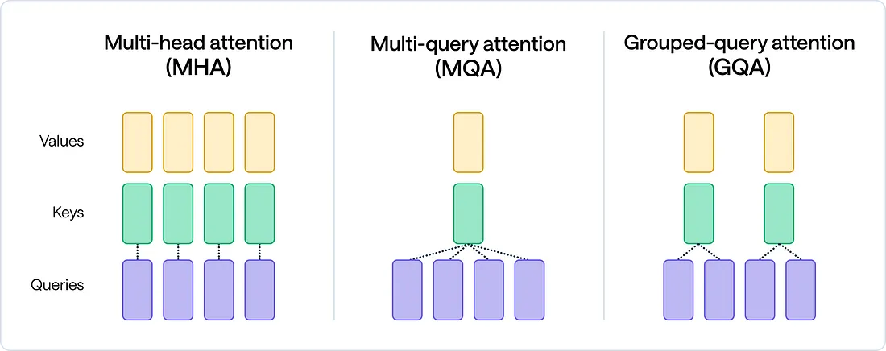

## Abstract
- "what problem is this work trying to tackle?"
- "how new is this effort?" (소개, 개요)  

대규모 언어 모델 (LLM) 은 대부분 Transformer의 Decoder 과정으로 이루어진 GPT 형태로 개발되어져 왔다. LLM의 Context Length가 길어질 수록 추론 성능은 Attention 연산의 최적화에 의해 크게 좌우된다. 이에 GPT 등의 LLM은 크게 Prefill, Decoding이라는 2단계로 동작하며 이때의 연산 특성이 다르다. 예를 들어, Decoder 과정에서는 초기 토큰을 Summerize하는 과정인 Prefill과정과 이후 함께 Batching 되어진 Request들이 KV Cache를 각 자 가지게되면서 해당 Cache를 Load를 하는과정에서의 Overhead로 Memory Bottleneck이 발생하게 된다.

특히, KV Cache는 시퀀스 길이에 따라 점점 커지며, Memory Bandwidth 병목의 핵심 원인이 된다. 그동안 많은 연구들이 이 문제를 해결하기 위해 NDP(PIM) 구조나 GPU/NPU 간의 연산 분산을 제안해왔지만, 대부분 KV Cache를 **하나의 일괄적인 데이터 덩어리(monolithic memory object)** 로만 취급해왔다.

본 블로그는 NeuPIMs와 *PIM is All You Need* 논문을 기반으로, 가속기의 특성에 따라 KV Cache를 **GEMM, GEMV 연산 특성과 계층(layer) 구조에 따라 세분화하고 배치 전략을 다르게 적용해야 한다는 새로운 관점**을 제시한다.

## Background
[Nvidia Documents](https://docs.nvidia.com/deeplearning/performance/dl-performance-matrix-multiplication/index.html)
### GEMM과 GEMV  
- GEMV 은 "GEneral Matrix Vector multiplication" 줄임말로써 Matrix-Vector 의 general 연산을 의미한다. $\alpha=1,\beta=0$ 일 때는 Matrix-Vector multiplication을 의미한다.
  $$
  y=\alpha Ax+\beta y
  $$
  일반적으로, GEMV 시간 복잡도는 $O(n^2)$ 을 가진다.
- GEMM 은 "GEneral Matrix Matrix multiplication" 의 줄임말로써 Matrix-Matrix 간의 General 연산을 의미한다. $\alpha=1, \beta=0$ 일 때는 Matrix-Vector Multiplication을 의미한다.
  $$
  y=\alpha AB+\beta C
  $$
  일반적으로, GEMM 시간 복잡도는 $O(n^3)$ 을 가진다.

### NDP, PIM
현대 Compute Architecture는 기본적으로 Von-Noiman Architecture 를 따르고 잇다.
Von-noiman Architecture 에선, PU (Processing Unit), Memory 를 구분하여 Computer Architecture 를 구성하고 PU는 기본적으로 Memory로부터 데이터를 받아 처리하여 연산을 처리한다. 따라, 몇 년 전까지는 prev work 들은 개 각각의 성능을 높일 수 있도록 FLOPS를 높일 수 있도록 GPU, TPU 등을 최적화하였고, Memory BW를 높혀 가속기까지 빠른 Memory Transfer가 가능하도록 Memory를 발전시켜왔다.  
하지만, accelerator의 발전임에도 AI 의 등장으로 많은 Workload의 데이터들이 점점 무거워지기 시작했고 이에 따라 accelerator 까지 메모리가 전달되는 bandwidth가 accelerator의 FLOPS를 따라가지 못하는 현상이 생겼다. 특히, LLM의 경우 초기 prompt 를 summerize하여 1 token 씩 생성하는 과정 속에서 각 각의 request들이 자신만의 cache를 accelerator로 load 하는 과정이 필요하며 해당 과정 속에서 많은 bottleneck이 발생하고 있다.  
Memory가 accelerator의 FLOPS를 따라가지 못하는 문제점 등을 해결하기 위해서 memory 에 저장된 data를 GPU, NPU에서 처리하지 않고, memory 에 가까운 위치에 작은 accelerator를 둬서 처리하는 기법들이 생겨났다. 해당 기법들은 Memory Chip 내부에 있느냐 혹은 메모리 chip 외부의 controller에서 처리하느냐에 따라 PIM과 NDP로 구분할 수 있다.
- PIM은 DRAM Chip 내부에서 sense amp를 직접 조작하여 연산하게되며 NDP에 비해 bandwidth가 크므로 빠른 연산이 가능하지만, chip 내부에 있어 연산 flexibility가 떨어지고 MAC(Multiplication-ACcumulation) 연산 등을 주로 수행한다. 
- NDP는 DRAM Controller 에 주로 위치하여 PIM보다 BW가 떨어지더라도 유연한 data format을 지원하며 general-purpose하게 연산을 수행할 수 있어 많은 활용가능성을 지니고 있다.

| 항목 | PIM (Processing-In-Memory)| NDP (Near-Data Processing)|
|-|-|-|
|**연산 처리속도**| 매우 빠름 (셀 내부 병렬 비트 연산)|빠름 (데이터 이동 줄어든 범용 연산)|
|**유연성 (Flexibility)**| 낮음 (특정 연산만 가능, 고정 회로)| 높음 (범용 ALU, SIMD 사용 가능)|
|**주요 처리 연산**| Bitwise (AND, OR, NOT), MAC, 간단한 비교|정렬, 필터링, DB 조인, ML inference 등 범용 연산|
|**연산기 위치**| DRAM/Flash **셀 내부 또는 센스앰프 근처**| **메모리 모듈 옆**, DIMM 또는 SSD 컨트롤러 주변|
|**대표 기술 예시**| Ambit, SIMDRAM, Flash-Cosmos, 3D-FPIM                   | UPMEM, Samsung AxDIMM, SmartSSD, GenStore|
|**장점**| 데이터 이동 제거, 초고속 연산, 높은 비트 병렬성| 범용성, 복잡한 연산 가능, 프로그래머블 구조|
|**단점**| 연산 제한적, 회로 유연성 낮음| 메모리~연산기 간 일부 데이터 이동 여전히 존재|

### PIM/NDP 와 GPU/NPU 가속기 특징 설명
GEMM의 경우에는 $O(N^3)$ 정도로 arithmetic intensity 가 높은 반면, GEMV 의 경우에는 $O(N^2)$ 정도로 GEMM에 비해 Operation Intensity가 다소 떨어지며, Memory-Bound 하게 동작한다.  
따라서, GPU와 NPU는 compute intensity가 높기 때문에 GEMM 에 최적화 되어 동작하게 된다. 반대로 GEMV의 경우에는 전체 연산을 처리하는 compute 이득에 비해 synchronous 및 memory move overhead가 커져 GEMM에 비해 비효율적으로 동작한다.  

GPU와 NPU 등은 GEMVs arithmetic intensity 가 높을 수록 효율적으로 연산한다. 그러므로 GEMM과 같이 Operation Intensity가 높은 연산에는 효율적으로 사용될 수 있지만, GEMV와 같이 Matrix-Vector Mutliplication은 다소

### LLM Transformer 의 세부동작과 Multi-Head Attention 과정과 GEMM,GEMV 과정의 설명
### KV-Cache 관리리스크

## Main 설명 (제목 바꿀 것, 여러개 있어도됨)
- "what contributions did this work make, and what impact should this work have?"
- "how new is this effort?"

<d-cite key="PIMisAllYouNeed"></d-cite>.

## Results (논문 실험결과 담아도되고 안담아도 되고..)
- "what are the limitations of this work?"
### Limitation
- **Attention의 변화와 GEMV의 감소**   
  최신 Llama3, DeepSeek LLM 등에서 MHA(Multi-Head Attention)에서 [GQA](https://arxiv.org/pdf/2305.13245)(Group-Query Attention), MQA(Multi-Query-Attention) 형태로 분화하고 있다. MQA는 각 head가 하나의 KV Cache를 공유하고 있고, GQA는 각 head가 일부 KV Cache를 공유하고 있다.
  
  이에따라 GQA, MQA에선 decoding 과정에서 하나의 head의 query가 1개의 행을 가지는 벡터에서  $\frac{\text{Origin Heads}}{\text{Group Size}}$ 만큼 행을 가진 matrix 로 바뀌게 되어 GEMV에서 GEMM으로 변한다는 문제가 있어 MHA 보다 NDP나 PIM에서의 처리효율이 떨어질 수 있다는 문제점이 존재한다.
  
## Conclusion
- 어떤 노력이 있었으며, 어떤식으로 최적화할 것인가?

## Citation (bibs 로 올릴 것이니까 생각 나는 논문들만 정리해둘것.)
- Attacc! 
- NeuPIMs
- PIM is all you need
- [GQA](https://arxiv.org/pdf/2305.13245)