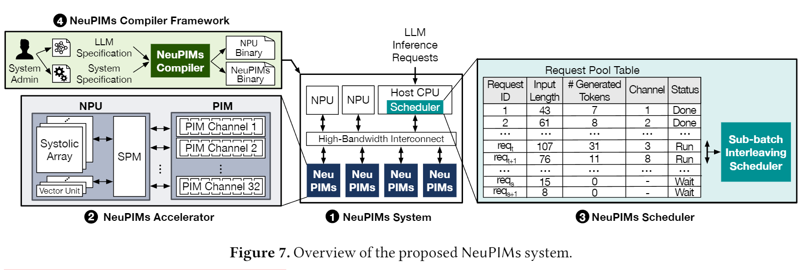
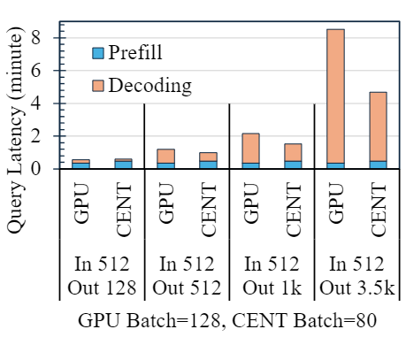

## Abstract
- "what problem is this work trying to tackle?"
- "how new is this effort?" (소개, 개요)  

대규모 언어 모델 (LLM) 은 대부분 Transformer의 Decoder 과정으로 이루어진 GPT 형태로 개발되어져 왔다. LLM의 Context Length가 길어질 수록 추론 성능은 Attention 연산의 최적화에 의해 크게 좌우된다. 이에 GPT 등의 LLM은 크게 Prefill, Decoding이라는 2단계로 동작하며 이때의 연산 특성이 다르다. 예를 들어, Decoder 과정에서는 초기 토큰을 Summerize하는 과정인 Prefill과정과 이후 함께 Batching 되어진 Request들이 KV Cache를 각 자 가지게되면서 해당 Cache를 Load를 하는과정에서의 Overhead로 Memory Bottleneck이 발생하게 된다.

특히, KV Cache는 시퀀스 길이에 따라 점점 커지며, Memory Bandwidth 병목의 핵심 원인이 된다. **Prompt 의 크기가 커짐에 따라 Attention 과정에서의 Memory Load**가 LLM Serving 과정에 많은 Overhead를 유발하고 있다. 본 블로그는 NeuPIMs와 *PIM is All You Need* 논문을 기반으로, 가속기의 특성에 따라 **GEMM, GEMV 연산 특성과 계층(layer) 구조에 따라 세분화하고 배치 전략을 다르게 적용해야 한다는 새로운 관점**을 제시한다.

## Background
[Nvidia Documents](https://docs.nvidia.com/deeplearning/performance/dl-performance-matrix-multiplication/index.html)
> GEMM과 GEMV  
- GEMV 은 "GEneral Matrix Vector multiplication" 줄임말로써 Matrix-Vector 의 general 연산을 의미한다. $\alpha=1,\beta=0$ 일 때는 Matrix-Vector multiplication을 의미한다.
  $$
  y=\alpha Ax+\beta y
  $$
  일반적으로, GEMV 시간 복잡도는 $O(n^2)$ 을 가진다.
- GEMM 은 "GEneral Matrix Matrix multiplication" 의 줄임말로써 Matrix-Matrix 간의 General 연산을 의미한다. $\alpha=1, \beta=0$ 일 때는 Matrix-Vector Multiplication을 의미한다.
  $$
  y=\alpha AB+\beta C
  $$
  일반적으로, GEMM 시간 복잡도는 $O(n^3)$ 을 가진다.

> NDP, PIM  

현대 Compute Architecture는 기본적으로 Von-Noiman Architecture 를 따르고 잇다.
Von-noiman Architecture 에선, PU (Processing Unit), Memory 를 구분하여 Computer Architecture 를 구성하고 PU는 기본적으로 Memory로부터 데이터를 받아 처리하여 연산을 처리한다. 따라, 몇 년 전까지는 prev work 들은 개 각각의 성능을 높일 수 있도록 FLOPS를 높일 수 있도록 GPU, TPU 등을 최적화하였고, Memory BW를 높혀 가속기까지 빠른 Memory Transfer가 가능하도록 Memory를 발전시켜왔다.  
하지만, accelerator의 발전임에도 AI 의 등장으로 많은 Workload의 데이터들이 점점 무거워지기 시작했고 이에 따라 accelerator 까지 메모리가 전달되는 bandwidth가 accelerator의 FLOPS를 따라가지 못하는 현상이 생겼다. 특히, LLM의 경우 초기 prompt 를 summerize하여 1 token 씩 생성하는 과정 속에서 각 각의 request들이 자신만의 cache를 accelerator로 load 하는 과정이 필요하며 해당 과정 속에서 많은 bottleneck이 발생하고 있다.  
Memory가 accelerator의 FLOPS를 따라가지 못하는 문제점 등을 해결하기 위해서 memory 에 저장된 data를 GPU, NPU에서 처리하지 않고, memory 에 가까운 위치에 작은 accelerator를 둬서 처리하는 기법들이 생겨났다. 해당 기법들은 Memory Chip 내부에 있느냐 혹은 메모리 chip 외부의 controller에서 처리하느냐에 따라 PIM과 NDP로 구분할 수 있다.
- PIM은 DRAM Chip 내부에서 sense amp를 직접 조작하여 연산하게되며 NDP에 비해 bandwidth가 크므로 빠른 연산이 가능하지만, chip 내부에 있어 연산 flexibility가 떨어지고 MAC(Multiplication-ACcumulation) 연산 등을 주로 수행한다. 
- NDP는 DRAM Controller 에 주로 위치하여 PIM보다 BW가 떨어지더라도 유연한 data format을 지원하며 general-purpose하게 연산을 수행할 수 있어 많은 활용가능성을 지니고 있다.

| 항목 | PIM (Processing-In-Memory)| NDP (Near-Data Processing)|
|-|-|-|
|**연산 처리속도**| 매우 빠름 (셀 내부 병렬 비트 연산)|빠름 (데이터 이동 줄어든 범용 연산)|
|**유연성 (Flexibility)**| 낮음 (특정 연산만 가능, 고정 회로)| 높음 (범용 ALU, SIMD 사용 가능)|
|**주요 처리 연산**| Bitwise (AND, OR, NOT), MAC, 간단한 비교|정렬, 필터링, DB 조인, ML inference 등 범용 연산|
|**연산기 위치**| DRAM/Flash **셀 내부 또는 센스앰프 근처**| **메모리 모듈 옆**, DIMM 또는 SSD 컨트롤러 주변|
|**장점**| 데이터 이동 제거, 초고속 연산, 높은 비트 병렬성| 범용성, 복잡한 연산 가능, 프로그래머블 구조|
|**단점**| 연산 제한적, 회로 유연성 낮음| 메모리~연산기 간 일부 데이터 이동 여전히 존재|

> PIM/NDP 와 GPU/NPU 가속기의 특징징

GEMM의 경우에는 $O(N^3)$ 정도로 arithmetic intensity 가 높은 반면, GEMV 의 경우에는 $O(N^2)$ 정도로 GEMM에 비해 Operation Intensity가 다소 떨어지며, Memory-Bound 하게 동작한다.  
따라서, GPU와 NPU는 compute intensity가 높기 때문에 GEMM 에 최적화 되어 동작하게 된다. 반대로 GEMV의 경우에는 전체 연산을 처리하는 compute 이득에 비해 synchronous 및 memory move overhead가 커져 GEMM에 비해 비효율적으로 동작한다.  

GPU와 NPU 등은 GEMVs arithmetic intensity 가 높을 수록 효율적으로 연산한다. 그러므로 GEMM과 같이 Operation Intensity가 높은 연산에는 효율적으로 사용될 수 있지만, GEMV와 같이 Matrix-Vector Mutliplication은 다소 Utilization이 떨어지는 특징이 있다.

> LLM Transformer 의 세부동작과 Multi-Head Attention 과정과 GEMM,GEMV 과정의 설명
- transformer 와 GPT
  
  ChatGPT, Llama3 와 같은 LLM들은 주로 GPT 구조를 따르고 있고 GPT는 Transformer 구조의 Decoding Stack 만 가져와서 1번의 Iteration마다 1개의 Token을 만들며 token을 생성한다는 특징이 있다. 

  
- Decoding Stack에서의 Prefill과 deocding 과정 차이
  
  GPT의 transformer 구조는 Decoding Stack은 MHA(Multi-Head Attention) block 과 Feed Forward Block으로 크게 구성되어 있다. 그리고 각 block은 아래의 주요한 Layer들로 구성되어 있다.
  - MHA Block  
    - QKV Generation: $ Q = XW^Q,\ K = XW^K,\ V = XW^V $  
    입력 임베딩으로부터 Query, Key, Value 행렬을 생성한다.  
    QKV를 주로 묶어서 $W_{[Q,K,V]}$ 를 곱하여 한 번에 계산한 후 Q,K,V 를 쪼개어 계산한다.

    - Logit: $QK^T $  
    Query와 Key의 내적을 통해 attention score(유사도)를 계산.

    - Softmax:  $ \alpha = \text{Softmax}(\frac{\text{Logit}}{\sqrt{d_k}}) $  
    Logit 값을 정규화하여 각 토큰에 대한 가중치 분포 생성  
   
    - attend: $ \text{Attention} = \alpha V $  
    Softmax로 얻은 가중치를 Value에 곱해 attention 출력을 계산한다.
    - Concat: $ \text{Concat}([head_1, ..., head_h]) $  
    여러 head의 attention 출력을 원본 벡터 크기로 연결.

    - QKV Projection: $ \text{Output} = \text{Concat}(...)W^O $  
    Concat된 출력을 선형 변환하여 다음 레이어에 전달달.
  - FF (Feed Forward) Block
    - Feed Forward 1: $ Z = XW_1 + b_1 $  
     각 토큰별로 첫 번째 선형 변환을 수행.

    - GeLU: $ \text{GeLU}(x) = 0.5x \left(1 + \tanh\left[\sqrt{\frac{2}{\pi}}(x + 0.044715x^3)\right]\right) $

    - Feed Forward 2: $ \text{Output} = ZW_2 + b_2 $  
    두 번째 선형 변환을 적용하여 최종 출력 생성성.

  해당 Layer는 입력 Prompt 를 처리하여 가장 초기의 토큰을 생성하는 **Prefill** 단계와 이후 \<EOS> 토큰을 생성할 때까지 1개의 토큰을 만드는 **Deocding** 단계로 구분되며 prefill은 compute-bound하고 decoding은 memory-bound하다는 특징으로 구분된다. 

## NeuPIMs & PIM is ALL you NEED
- "what contributions did this work make, and what impact should this work have?"
- "how new is this effort?"

> 실제 연산처리 관점에서의의 Prefill, Decoding
- Prefill  
  Prefill 과정에서의 LLM 연산은 주로 Matrix-Matrix Multiplication (GEMM) 형태로 구성되어있다.
  Prefill의 $X:[\text{N}_{prompt}, d_{emb}]$ 는 prompt 토큰의 개수만큼 matrix 형태로 이루어져 있다. $d_{emb}$는 "각 토큰을 표현하는 벡터의 차원"을 의미한다
  - MHA Block
    - QKV Generation (GEMM): $WQ, WK, WV :[\text{N}_{prompt}, d_{emb}] \times [d_{emb}, d_{emb}]=[\text{N}_{prompt}, d_{emb}]$ 
    - Attention : 편의상 Logit,Softmax,Attend를 묶어 attention 과정이라고 부른다. 그리고, 각 head가 $Q,K,V$ 를  $\frac{d_{emb}}{H}$ 로 나누어 헤드들이 병렬적으로 자신의 Attention을 처리한다.( $H=\text{Head 수}$)   
    $ O=\text{Softmax}(\frac{QK^T}{\sqrt{d_k}})V $는 아래와 같이 **GEMM** 형태로 처리된다.  
    $Q \times K^T \times V:  [N_{prompt}, \frac{d_{emb}}{H}]\times[\frac{d_{emb}}{H}, N_{prompt}] \times [N_{prompt}, \frac{d_{emb}}{H}]$  
    ※ $\sqrt{d_k}$ 는 scalar 라 생략.
    - Concat: $ \text{Concat}([head_1:[N_{prompt}, \frac{d_{emb}}{H}], ..., head_h:[N_{prompt}, \frac{d_{emb}}{H}]]) :[\text{N}_{prompt}, d_{emb}]$ 
  - FF Block
    - Feed Forward 1: $ Z = XW_1+ b_1 $ 에서 $XW_1:[\text{N}_{prompt}, d_{emb}]\times[d_{emb},4\times d_{emb}]$ 형태로 GEMM 형태의 연산이 처리된다.
    - GeLU: 단순 scalar 곱
    - Feed Forward 2: $ \text{Output} = ZW_2 + b_2 $ 에서 $XW_2:[\text{N}_{prompt}, 4\times d_{emb}]\times[4\times d_{emb},d_{emb}]$ 형태로 GEMM 형태의 연산이 처리된다.

    

- Deocding  
  Deocding 과정에서 각 Request들은 이전에 계산된 Query, Value Matrix를 다시 사용하므로 KV-Cache 형태로 메모리에 저장을 해두었다가 다시 이어붙이는 형태로 연산이 이루어진다. 그리고 Query가 이전에 생성한 **1개의 토큰** 을 사용하므로 Vector 형태로 존재하여 Attention과정에서 다수의 GEMV연산과 무거운 KV Cache memory-load 과정으로 memory-bound 과정으로 주로 취급된다.

  - MHA Block: **GEMV** 비중이 높아짐
    - QKV Generation (GEMM): $XW_Q,XW_K, XW_V: [1, d_{emb}] \times [d_{emb}, d_{emb}]$ 로, Vector-Multiplication 곱이 발생한다.  
    각 K,V 는 이전의 KV Cache를 memory로부터터 Load하여 연결하여야 하며 KV는 $K,V: [N_{prev}+1, d_{emb}]$  형태로 구성된다. 하나의 request는 GEMV 형태처럼 보일 수 있으나, decoding의 여러 request가 동일한 weight를 공유하기 때문에 실제로는 $[N_{batches}, d_{emb}] \times [d_{emb}, d_{emb}]$ 형태로 GEMM 연산으로 처리된다.
    - Attention :  $Q \times K^T \times V:  [1, \frac{d_{emb}}{H}]\times[\frac{d_{emb}}{H}, N_{prev}+1] \times [N_{prev}+1, \frac{d_{emb}}{H}]$  으로 무거운 KV Cache를 load하는 과정에서 Memory-Bound 형태로 연산이 진행된다.
    - Concat: $ \text{Concat}([head_1:[1, \frac{d_{emb}}{H}], ..., head_h:[1, \frac{d_{emb}}{H}]]) :[1, d_{emb}]$ 
  - FF Block
    - Feed Forward 1: $ Z = XW_1+ b_1 $ 에서 $XW_1:[1, d_{emb}]\times[d_{emb},4\times d_{emb}]$ 형태로 GEMV 형태의 연산이 처리된다.
    - GeLU: 단순 scalar 곱
    - Feed Forward 2: $ \text{Output} = ZW_2 + b_2 $ 에서 $XW_2:[1, 4\times d_{emb}]\times[4\times d_{emb},d_{emb}]$ 형태로 하나의 Request는 GEMV 형태이지만, Feed Forward 과정은 여러 requests 들이 weight를 공유하여, linear operation이기 때문에 여러 request를 묶은 하나의 Batch를 한 번에 처리하므로로 GEMM 형태의 연산이 처리된다. 즉, $[N_{batches}, d_{emb}] \times [d_{emb}, 4\times d_{emb}] \times [4\times d_{emb}, d_{emb}]$ 형태로 처리된다.

즉, Prefill의 경우에는 대부분이 연산이 GEMM 형태로 이루어지며, 초기 단계로인하여 각 Request가 이전 단계의 KV Cache가 없기 때문에 compute-bound하게 연산이 가능하다. 반면, decoding의 경우에는 각자의 request마다 자신만의 KV Cache가 존재하고 해당 길이가 Attention이 길어질 수록 memory bottleneck이 많이 발생하게 된다.  
 

Prefill과 decoding 과정에서의 연산 특성과 PIM 기술을 활용하여 Long Context LLM을 Memory, Compute 측면에서 효율적으로 처리할 수 있는 Serving Architecture를 소개한다.
NeuPIMs의 경우 기존의 PIM의 Memory 기능과 PIM-GEMV 연산 기능을 parallel하게 처리 가능 하도록 구조 변경을 통해 main acclerator 에는 prefill 과 같은 GEMM을 주로 처리하고, decoding 의 GEMV 부분을 PIM에서 asynchronous 하게 처리할 수 있게 설계하였다.

PIM is All you need에서는 LLM의 Prefill 과정이 End-to-End 과정에서 적은 비중을 차지함을 이용하여 전력 소비량이 높은 GPU, TPU를 제거하고 NDP 기술인 PNM과 다수의 PIM을 활용하여 높은 전력 효율을 가진 LLM PIM serving system을 소개한다.

> NeuPIMs Arichetecture 소개  

NeuPIMs는 기존의 PIM에서 memory mode와 PIM(GEMV 처리)mode를 동시 실행이 불가능했던 점을 보완하여 GEMM을 효과적으로 처리할 수 있는 작은 NPU와 Advacned PIM을 같은 chip 내부에 둬서 decoding attention 과정을 효과적으로 처리할 수 있는 architecture 를 소개한다.  

특히, 기존의 PIM은 메모리 옆에 존재하여, PIM의 GEMV연산에 사용되는 buffer가 memeory load buffer와 동일하여 memory load 과정과 GEMV 를 동시수행이 불가능한 한계점을 고려하여 dual-buffer system을 구축하였다.

Dual-Buffer를 사용한다면 N개 request batch를 N/2 개씩 sub-batch로 둬서 NeuPIMs (NPU-V와 PIM) 가 Attention을 처리하는 동안 Compute-bound 연산인 QKV Generation과 FFN을 나머지 N/2 개의 sub-batch가 처리될 수 있게 overlapping 함으로써 memory bottleneck과 compute bottleneck을 효과적으로 해결할 수 있게 되었다.

>  NeuPIMs Results  

  NeuPIMs가 GEMV, GEMM을 PIM과 NPU로 나누어 처리하였을 때 기존의 NPU-Only system에서보다 1.5 배 이상 효과적으로 LLM 을 Serving할 수 있었다. 

> PIM is All you need  

해당 논문에서는 context length가 길어지고 있는 점과 GPU, TPU보다 전력효율이 훨씬 좋은 PIM이 GEMV를 처리하고 자체 제작한 저전력 PNM(Processing-Near-Memory) 장치를 DRAM Controller에 두어 GEMM을 처리하도록 한 architecture 를 제시한다. PNM은 GEMV를 제외한 softmax의 reduce tree나 exponent processors 와 activation function(GeLU, ReLU) 에서 필요한 RISC-V Core 등을 포함한 작은 소자를 추가적으로 두었다.

NeuPIMs에선 decoding의 GEMV를 제외한 나머지 연산은 NPU에서 처리하던 것과 달리 PIM is all you need는 attention을 제외한 나머지를 PNM 장치에서 처리하되, 다수의 Device로 Broadcast 및 Gather 하여 처리하도록 하였다.

> PIM is ALL you need Results  

  
  PIM is All you need에서의 실제 결과를 보았을 때 Decoding output token 수가 커질 수록 기존 GPU에 비하여 latency가 줄어드는 모습을 볼 수 있다. 다만, PIM is all you need에서는 prefill 과정에서 GPU보다 PNM의 성능하락이 상당히 있음을 볼 수 있다. 이러한 점은 prefill이 커질 수록 성능향상을 보기 어려울 수 있다는 paper limitation으로 생각된다.

### Limitation
- **Attention의 변화와 GEMV의 감소**   
  최신 Llama3, DeepSeek LLM 등에서 MHA(Multi-Head Attention)에서 [GQA](https://arxiv.org/pdf/2305.13245)(Group-Query Attention), MQA(Multi-Query-Attention) 형태로 분화하고 있다. MQA는 각 head가 하나의 KV Cache를 공유하고 있고, GQA는 각 head가 일부 KV Cache를 공유하고 있다.
  
  이에따라 GQA, MQA에선 decoding 과정에서 하나의 head의 query가 1개의 행을 가지는 벡터에서  $\frac{\text{Origin Heads}}{\text{Group Size}}$ 만큼 행을 가진 matrix 로 바뀌게 되어 GEMV에서 GEMM으로 변한다는 문제가 있어 MHA 보다 NDP나 PIM에서의 처리효율이 떨어질 수 있다는 문제점이 존재한다.
  
## Conclusion
- 어떤 노력이 있었으며, 어떤식으로 최적화할 것인가?  
본 연구에서는 대규모 언어 모델(LLM)의 serving 과정에서 발생하는 prefill과 decoding 간 연산 특성 차이를 분석하고, 이에 따라 발생하는 memory bottleneck 문제를 해결하기 위한 구조적 접근을 제안하였다.

전통적인 GPU, TPU 기반의 가속기 시스템은 연산 성능(FLOPS)에 최적화되어 있어 compute-bound 작업(GEMM)에 효율적이나, memory-bound 작업(GEMV)에서는 KV cache 로드로 인한 bandwidth 병목이 발생하며, 이는 특히 LLM의 decoding 단계에서 심화된다.

이러한 문제를 해결하기 위한 노력으로, 최근 PIM (Processing-In-Memory) 및 NDP (Near-Data Processing) 기술이 도입되었다.

NeuPIMs는 PIM의 memory access와 연산이 동시 불가능한 구조적 제약을 해결하기 위해 Dual-buffer system과 NPU-V 통합 구조를 제안함으로써, GEMM(GPU-like 연산)은 NPU가, GEMV(memory-heavy 연산)은 PIM이 병렬 처리하도록 하여 효율적인 연산 분리를 가능케 했다.

반면, PIM is All You Need는 전력 효율 관점에서 GPU 및 NPU 없이, PIM + PNM 구조만으로 LLM serving을 수행하며, GEMV 및 기타 연산을 memory controller 근처에서 처리함으로써 전력 및 latency 효율을 극대화하였다.

이러한 구조들은 공통적으로 decoding 과정의 GEMV 연산을 memory-proximal 위치에서 처리함으로써, LLM serving의 latency 병목을 해소하고자 한다.

하지만, 최근 LLM 구조는 MHA → GQA/MQA와 같이 attention 구조가 변화함에 따라, GEMV가 아닌 GEMM 형태로 attention 연산이 변형되는 추세이다. 이러한 변화는 기존 PIM 기반 구조의 효율성을 저해할 수 있으며, PIM/NDP-friendly 연산 구조에 대한 재설계가 필요하다.

## Related Work
> KV-Cache Managing  

prefill과 다르게 decoding이 수행될 수록 각 request마다 KV Cache가 커짐에 따라 가속기에서 한 번에 KV Cache를 처리하기가 힘들어졌다. 그래서 이를 최적화하기 위해 PagedAttention에선 연속적인 KV Cache 패러다임에서 비연속적인 KV Cache형태로 페이징하여 관리를 하거나 GPU HW 구조에 따른 최적화를 시도한 Flash Attention 등이 소개되었다.  단일 GPU 환경 뿐 아니라 KV Cache Load 양을 획기적으로 늘릴 수 있도록 Pooling System을 구축하는 등의 연구가 진행되고 있다.

<d-cite key="PagedAttention"></d-cite>
<d-cite key="FlashAttention"></d-cite>
<d-cite key="PIMisAllYouNeed"></d-cite>.

## Citation (bibs 로 올릴 것이니까 생각 나는 논문들만 정리해둘것.)
- Attacc! 
- NeuPIMs
- PIM is all you need
- [GQA](https://arxiv.org/pdf/2305.13245)