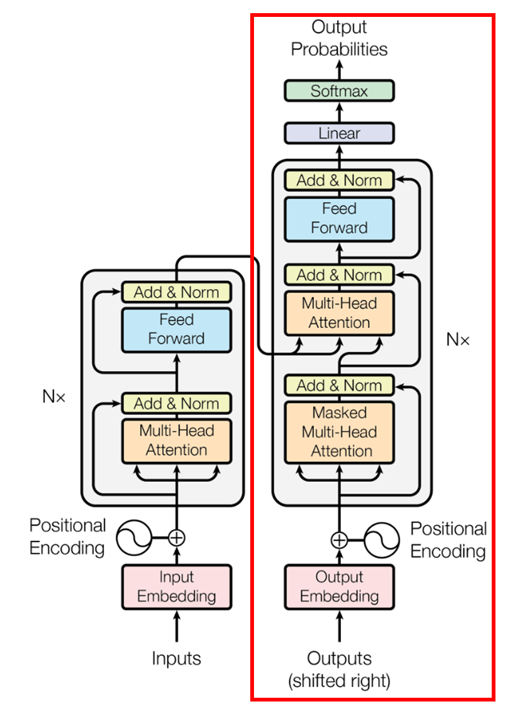
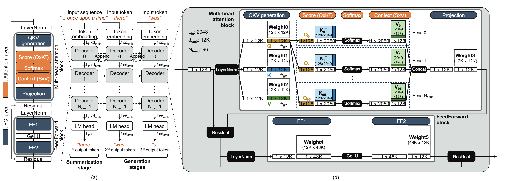
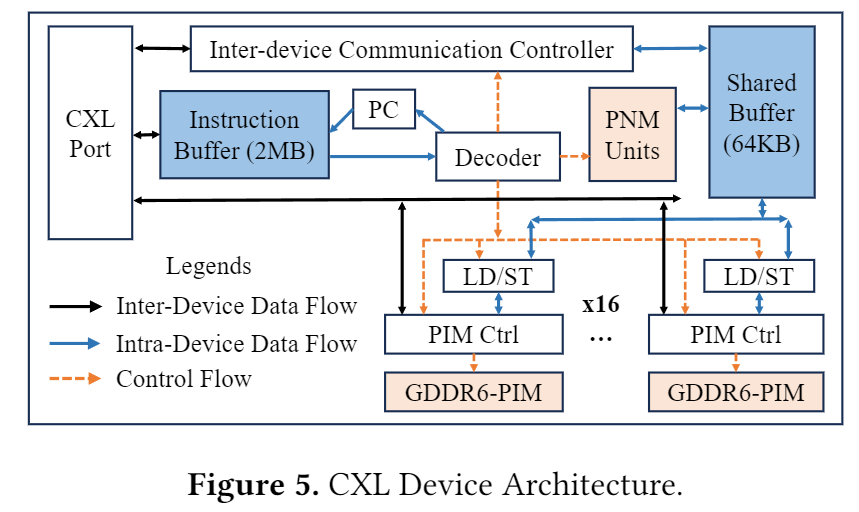
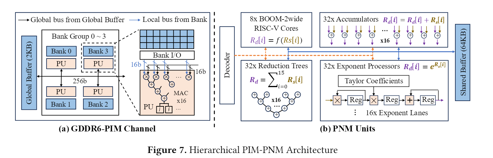
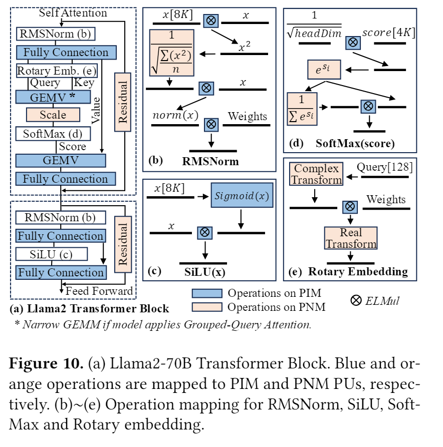
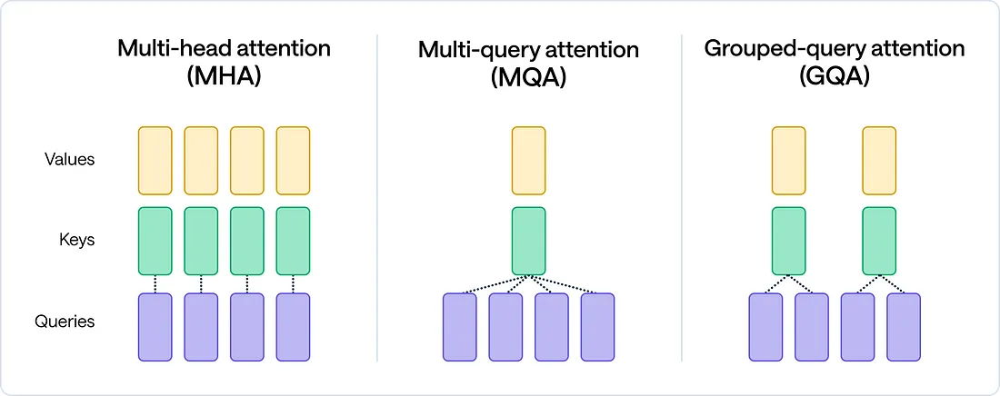

## Abstract
- "what problem is this work trying to tackle?"
- "how new is this effort?" (소개, 개요)  

Large Language Models (LLMs) have mostly been developed in the form of GPT, which is based on the Decoder phase of the Transformer. As the context length of an LLM increases, inference performance becomes highly dependent on the optimization of the Attention operation. Accordingly, LLMs such as GPT operate in two major stages: Prefill and Decoding, each with distinct computational characteristics. For example, during the Decoder phase, the initial tokens are summarized in the Prefill stage, and subsequently, batched requests each maintain their own KV Cache. The process of loading these caches introduces overhead, resulting in a memory bottleneck.

In particular, the KV Cache grows with the sequence length and becomes a key source of memory bandwidth bottlenecks. **As the size of the prompt increases, the memory load during the Attention operation introduces** significant overhead in LLM serving. This blog, based on NeuPIMs and the paper PIM is All You Need, presents a new perspective that **computational characteristics such as GEMM and GEMV operations, as well as the layer structure, should be carefully segmented and treated with distinct batching strategies depending on the type of accelerator used.**

## Background
[Nvidia Documents](https://docs.nvidia.com/deeplearning/performance/dl-performance-matrix-multiplication/index.html)
> GEMM & GEMV  
  - **GEMV** stands for "GEneral Matrix Vector multiplication," referring to a general operation between a matrix and a vector. When $\alpha=1$ and $\beta=0$, it denotes a standard matrix-vector multiplication:
  $$
  y=\alpha Ax+\beta y
  $$
  In general, GEMV has a time complexity of $O(n^2)$.

  - **GEMM** stands for "GEneral Matrix Matrix multiplication," referring to a general operation between two matrices. When $\alpha=1$ and $\beta=0$, it denotes a standard matrix-matrix multiplication:
  $$
  y=\alpha AB+\beta C
  $$
  In general, GEMM has a time complexity of $O(n^3)$.

> NDP, PIM  

Modern compute architectures are fundamentally based on the Von Neumann architecture. In the Von Neumann architecture, the Processing Unit (PU) and Memory are separated, and the computer architecture is organized such that the PU receives data from memory to perform computations. Accordingly, until a few years ago, previous works focused on enhancing the performance of each component by optimizing GPUs and TPUs to increase FLOPS, and improving memory to enable fast memory transfer to accelerators by increasing memory bandwidth.

However, despite advancements in accelerators, the emergence of AI has caused workloads to become increasingly data-intensive, leading to a situation where the memory bandwidth cannot keep up with the FLOPS of accelerators. In particular, for LLMs, the process of summarizing the initial prompt and generating one token at a time requires each request to load its own cache into the accelerator, resulting in significant bottlenecks during this process.

To address the issue where memory cannot keep up with the FLOPS of accelerators, techniques have been developed to process data stored in memory not in GPUs or NPUs, but using small accelerators placed close to the memory. These techniques can be classified into PIM (Processing-In-Memory) and NDP (Near-Data Processing) depending on whether the computation is performed inside the memory chip or in a controller outside the memory chip.

PIM performs computations by directly manipulating the sense amplifiers inside the DRAM chip. Compared to NDP, it provides higher bandwidth and thus enables faster computations, but being inside the chip, it has lower computational flexibility and primarily performs MAC (Multiplication-ACcumulation) operations.

NDP is typically located in the DRAM controller. Although it has lower bandwidth than PIM, it supports flexible data formats and performs general-purpose computations, offering a wide range of application possibilities.

| Item | PIM (Processing-In-Memory)| NDP (Near-Data Processing)|
|-|-|-|
|**Computation Speed**| 	Very fast (in-cell parallel bitwise operations)|Fast (general-purpose computation with reduced data movement)|
|**Flexibility**| 	Low (only specific operations, fixed circuits)| High (can use general-purpose ALU, SIMD)|
|**Main Computation Types**| 	Bitwise (AND, OR, NOT), MAC, simple comparisons |General-purpose operations such as sorting, filtering, DB joins, ML inference|
|**Location of Processing Unit**| Inside DRAM/Flash cells or near sense amplifiers| Next to memory modules, around DIMM or SSD controller|
|**Pros**| 	Eliminates data movement, ultra-fast computation, high bit-level parallelism| Versatility, supports complex operations, programmable structure|
|**Cons**| Limited operations, low circuit flexibility| 	Some data movement still exists between memory and processor|

> PIM/NDP & GPU/NPU Accelater Features

In the case of GEMM, the arithmetic intensity is high with a complexity of approximately $O(N^3)$, whereas GEMV has a lower operation intensity of around $O(N^2)$ and tends to operate in a memory-bound manner.
Therefore, GPUs and NPUs, which are optimized for high compute intensity, perform most efficiently with GEMM operations. In contrast, GEMV operations tend to be less efficient due to the relatively large overhead from synchronization and memory movement compared to the computational gain.

GPUs and NPUs operate more efficiently when the arithmetic intensity of GEMV is high. Thus, while they are well-suited for high-operation-intensity tasks like GEMM, they tend to show lower utilization for matrix-vector multiplications such as GEMV.

> Explanation of Detailed Operations in LLM Transformers, Multi-Head Attention, and GEMM/GEMV Computation
- transformer & GPT
  
  LLMs such as ChatGPT and Llama3 primarily follow the GPT architecture, which adopts only the decoding stack of the Transformer structure. A key characteristic of this architecture is that it generates one token per iteration during the token generation process.

  
- Difference Between the Prefill and Decoding Phases in the Decoding Stack
  
  The transformer structure in GPT primarily consists of a Decoding Stack, which is composed of Multi-Head Attention (MHA) blocks and Feed Forward blocks. Each of these blocks is made up of the following key layers:
  - MHA Block
    - QKV Generation: $$ Q = XW^Q,\ K = XW^K,\ V = XW^V $$
    Query, Key, and Value matrices are generated from the input embeddings.
    Typically, QKV are calculated in a fused manner using a combined weight matrix $$W_{[Q,K,V]}$$, then split into individual components.

    - Logit: $$ QK^T $$
      Attention scores (similarities) are computed via the dot product of Query and Key.

    - Softmax: $$ \alpha = \text{Softmax}(\frac{\text{Logit}}{\sqrt{d_k}}) $$
      The Logits are normalized to produce attention weight distributions over tokens.

    - Attend: $$ \text{Attention} = \alpha V $$
      The weighted sum of the Value vectors is computed using the attention weights.

    - Concat: $$ \text{Concat}([head_1, ..., head_h]) $$
      Attention outputs from multiple heads are concatenated into a single vector.

    - QKV Projection: $$ \text{Output} = \text{Concat}(...)W^O $$
      The concatenated output is linearly projected to match the input dimension for the next layer.

  - Feed Forward (FF) Block

    - Feed Forward 1: $$ Z = XW_1 + b_1 $$
    Applies the first linear transformation to each token.

    - GeLU Activation:
    $$ \text{GeLU}(x) = 0.5x \left(1 + \tanh\left[\sqrt{\frac{2}{\pi}}(x + 0.044715x^3)\right]\right) $$

    - Feed Forward 2: $$ \text{Output} = ZW_2 + b_2 $$
    Applies the second linear transformation to produce the final output.

  This sequence of layers is used in two distinct phases: the **Prefil**l phase, where the input prompt is processed and the first token is generated, and the **Decoding** phase, where one token is generated at a time until the <EOS> token. These phases are distinguished by their computational characteristics: Prefill is compute-bound, while Decoding is memory-bound.

## NeuPIMs & PIM is ALL you NEED
- "what contributions did this work make, and what impact should this work have?"
- "how new is this effort?"

> Prefill and Decoding from the Perspective of Actual Computation
- Prefill  
  During the prefill stage, LLM computations are primarily composed of matrix-matrix multiplications, i.e., GEMM operations.
  The input $X:[\text{N}{\text{prompt}}, d{\text{emb}}]$ is structured as a matrix, where $\text{N}{\text{prompt}}$ denotes the number of prompt tokens, and $d{\text{emb}}$ is the dimensionality of the embedding vector representing each token.
  - MHA Block
    - QKV Generation (GEMM):  
      $$ W^Q, W^K, W^V : [\text{N}{\text{prompt}}, d{\text{emb}}] \times [d_{\text{emb}}, d_{\text{emb}}] = [\text{N}{\text{prompt}}, d{\text{emb}}]$$
    - Attention :   
      For convenience, the Logit, Softmax, and Attend steps are collectively referred to as the attention process.
      Each head splits the $$Q,  K, V$$ matrices by $$\frac{d_{\text{emb}}}{H}, (H = \text{number of heads})$$ and processes its own attention in parallel
      The operation $$O = \text{Softmax}\left(\frac{QK^T}{\sqrt{d_k}}\right)V$$ is computed in the form of **GEMM** as follows:  
      $$Q \times K^T \times V:  [N_{prompt}, \frac{d_{emb}}{H}]\times[\frac{d_{emb}}{H}, N_{prompt}] \times [N_{prompt}, \frac{d_{emb}}{H}]$$
      ※ (Note: $\sqrt{d_k}$ is a scalar and is omitted in computation.)
    - Concat: $$ \text{Concat}([head_1:[N_{prompt}, \frac{d_{emb}}{H}], ..., head_h:[N_{prompt}, \frac{d_{emb}}{H}]]) :[\text{N}_{prompt}, d_{emb}]$$
  - FF Block
    - Feed Forward 1: $$ Z = XW_1+ b_1  \text{ where, } XW_1:[\text{N}_{prompt}, d_{emb}]\times[d_{emb},4\times d_{emb}]$$ is computed using GEMM.
    - GeLU: Simple scalar-wise multiplication and activation.
    - Feed Forward 2: $$ \text{Output} = ZW_2 + b_2  \text{ where, } XW_2:[\text{N}_{prompt}, 4\times d_{emb}]\times[4\times d_{emb},d_{emb}]$$ is also computed as GEMM.

    

- Deocding  
During the Decoding phase, each request reuses previously computed Key and Value matrices, which are stored in memory as KV Cache and concatenated back during computation. Since the Query corresponds to **only one newly generated token**, it exists in the form of a vector. As a result, the attention operation involves multiple GEMV computations along with heavy KV Cache memory loads, making this phase predominantly memory-bound.

  - MHA Block: Emphasis on **GEMV** operations increases
    - QKV Generation (GEMM): $$XW_Q,\ XW_K,\ XW_V: [1, d_{\text{emb}}] \times [d_{\text{emb}}, d_{\text{emb}}]$$ These are vector-matrix multiplications.
    For Key and Value, the previous KV Cache is loaded from memory and concatenated. The KV matrices have shape:  
    $$K,V: [N_{prev}+1, d_{emb}]$$   
    Although a single request may appear as a GEMV, multiple decoding requests share the same weights. Thus, in practice, this is processed as a GEMM with shape:  
    $$[N_{batches}, d_{emb}] \times [d_{emb}, d_{emb}]$$
    - Attention :  $$Q \times K^T \times V:  [1, \frac{d_{emb}}{H}]\times[\frac{d_{emb}}{H}, N_{prev}+1] \times [N_{prev}+1, \frac{d_{emb}}{H}]$$  
    This involves heavy KV Cache loading from memory, and the operation is typically memory-bound.
    - Concat: $$ \text{Concat}([head_1:[1, \frac{d_{emb}}{H}], ..., head_h:[1, \frac{d_{emb}}{H}]]) :[1, d_{emb}]$$
  - FF Block
    - Feed Forward 1:  $$Z = XW_1+ b_1\text{ where, }XW_1:[1, d_{emb}]\times[d_{emb},4\times d_{emb}]$$
    This is processed as a GEMV operation.
    - GeLU: A simple element-wise scalar operation.
    - Feed Forward 2:  
    $$ \text{Output} = ZW_2 + b_2 \text{ where, } XW_2:[1, 4\times d_{emb}]\times[4\times d_{emb},d_{emb}]$$  
     While each request individually resembles a GEMV, since all decoding requests share the same weights and the FF block is a linear operation, multiple requests can be batched and computed together. This results in a GEMM operation of the form:  
     $$[N_{batches}, d_{emb}] \times [d_{emb}, 4\times d_{emb}] \times [4\times d_{emb}, d_{emb}]$$

In summary, Prefill computations are predominantly in the form of GEMM operations. Since this is the initial stage, there is no prior KV Cache per request, allowing the operations to be processed in a compute-bound manner. In contrast, during Decoding, each request maintains its own KV Cache, and as the sequence length grows, memory bottlenecks become more severe due to increased memory load in the attention mechanism.
 

Based on the distinct computational characteristics of prefill and decoding phases, this section introduces serving architectures that leverage PIM technologies to handle long-context LLMs efficiently in terms of memory and compute.

- NeuPIMs proposes a redesigned architecture where the memory functionality and GEMV computation of PIM can be executed in parallel. This allows the main accelerator (e.g., GPU) to focus on compute-intensive GEMM operations in the prefill phase, while the memory-bound GEMV operations in the decoding phase are offloaded to PIM units and processed asynchronously.

- In PIM is All You Need, the authors observe that the Prefill phase contributes only a small portion of the end-to-end LLM workload. Leveraging this, they propose eliminating power-hungry GPUs/TPUs and introduce a highly power-efficient LLM PIM serving system based on PNM (a type of NDP) and multiple PIM units to handle the entire pipeline efficiently.

> NeuPIMs Arichetecture Introduce

NeuPIMs addresses a key limitation of traditional PIM architectures, where memory mode and PIM mode (for GEMV operations) could not be executed simultaneously. To overcome this, NeuPIMs introduces an architecture that integrates a lightweight NPU and advanced PIM within the same chip, enabling efficient processing of decoding attention operations.

In particular, traditional PIM units are located near memory and share the same buffer for both memory load operations and GEMV computations, making concurrent execution infeasible. To resolve this, NeuPIMs implements a dual-buffer system, allowing memory loading and GEMV execution to occur in parallel, thereby improving decoding efficiency and overall throughput.

By employing a dual-buffer system, NeuPIMs enables the batching of N requests into two sub-batches of N/2 each. While one sub-batch is processed by NeuPIMs (NPU-V and PIM) to handle the memory-bound attention computations, the other sub-batch simultaneously performs the compute-bound QKV generation and feed-forward network (FFN) computations.

This overlapping of memory-bound and compute-bound workloads allows NeuPIMs to effectively mitigate both memory and compute bottlenecks, leading to improved parallelism and higher overall throughput in LLM serving.

>  NeuPIMs Results  

When NeuPIMs offloads GEMV operations to PIM and delegates GEMM operations to the NPU, it achieves over 1.5× improvement in LLM serving performance compared to a traditional NPU-only system. This performance gain is attributed to the efficient division of labor between memory-bound and compute-bound tasks, enabled by the hybrid PIM-NPU architecture.

> PIM is All you need  

The paper presents an architecture designed to address the increasing context length in LLMs by leveraging the high energy efficiency of PIM compared to GPUs and TPUs. In this architecture, PIM units are responsible for GEMV operations, while a custom-designed low-power PNM (Processing-Near-Memory) device, placed near the DRAM controller, handles GEMM computations.

The proposed PNM is not limited to GEMM; it also includes lightweight components such as reduce trees for softmax, exponent processors, and RISC-V cores to support essential functions like activation operations (e.g., GeLU, ReLU). This co-design enables efficient and low-power LLM serving by distributing tasks to specialized near-memory processing elements.

In NeuPIMs, all operations except for the GEMV in decoding are handled by the NPU. In contrast, PIM is All You Need takes a different approach: it offloads all operations except for attention to the PNM device, which is placed near the DRAM controller. These operations are then executed by broadcasting and gathering data across multiple devices, enabling efficient distributed execution across a network of lightweight, near-memory processing units.

> PIM is ALL you need Results  

  
  In PIM is All You Need, experimental results show that as the number of decoding output tokens increases, the system achieves lower latency compared to traditional GPUs. This demonstrates the effectiveness of the architecture in handling long decoding phases.

  However, the paper also reveals that during the prefill phase, the PNM exhibits noticeably lower performance than GPUs. This suggests a limitation of the proposed system—as the size of the prefill grows, performance improvements become harder to achieve. This trade-off is acknowledged as a limitation of the paper, indicating that the architecture is particularly advantageous for decoding-heavy workloads, but may underperform when prefill dominates the workload.

### Limitation
- **Changes in Attention Mechanisms and the Decline of GEMV Usage**   
In recent models such as **LLaMA3** and **DeepSeek LLM**, the traditional **Multi-Head Attention (MHA)** mechanism has evolved into variants like **GQA (Group-Query Attention)** and **MQA (Multi-Query Attention)** [GQA paper](https://arxiv.org/pdf/2305.13245). In **MQA**, all attention heads share a **single KV Cache**, whereas in **GQA**, groups of heads share **a subset** of the KV Cache.

As a result, during **decoding**, the query from a single head originally a **vector with a single row** is transformed into a **matrix** with

$$
\frac{\text{Origin Heads}}{\text{Group Size}}
$$

rows in GQA or MQA. This shifts the operation from a **GEMV** to a **GEMM**, introducing a computational overhead.

This transformation poses a challenge for **PIM or NDP architectures**, which are typically optimized for **GEMV-style operations** in decoding. Thus, **GQA and MQA may reduce the processing efficiency** of such memory-centric accelerators compared to standard MHA.

  
## Conclusion
* **What efforts have been made, and how should optimization be approached?**
This study analyzes the computational differences between **prefill** and **decoding** phases in large language model (LLM) serving and proposes a structural approach to address the resulting **memory bottleneck**.

Traditional GPU and TPU-based accelerators are optimized for **compute-bound operations (GEMM)** due to their high FLOPS capabilities. However, they face significant **bandwidth bottlenecks** when performing **memory-bound operations (GEMV)**, particularly during the decoding phase of LLMs where frequent KV cache loads dominate.

To overcome this issue, recent research has introduced **Processing-In-Memory (PIM)** and **Near-Data Processing (NDP)** technologies.

* **NeuPIMs** addresses the structural limitation of conventional PIMs, which could not handle memory access and computation simultaneously. It introduces a **dual-buffer system** and a **NPU-V integration** strategy that enables **GEMM operations** (e.g., QKV projection and FFN) to be handled by the NPU, while **GEMV operations** (e.g., decoding attention) are offloaded to PIM units for **parallel and efficient execution**.

* In contrast, **PIM is All You Need** pursues **maximum power efficiency** by removing GPUs and NPUs altogether. It utilizes a **PIM + PNM** architecture to process both GEMV and other computations near the memory controller, significantly improving both **latency** and **energy efficiency**.

These architectures share a common strategy: offloading **decoding-phase GEMV operations to memory-proximal units**, thereby **mitigating latency bottlenecks** in LLM serving.

However, modern LLMs are shifting from **MHA to GQA/MQA** attention mechanisms, in which shared KV cache structures **transform attention from GEMV to GEMM** computations. This shift potentially **undermines the efficiency** of PIM-based architectures, which are optimized for GEMV.

As such, future research must consider **rearchitecting attention layers** and computation pipelines to be **PIM/NDP-friendly**, ensuring compatibility and sustained efficiency in the face of evolving LLM architectures.

## Related Work
> KV-Cache Managing  

Unlike the **prefill** phase, during **decoding**, the size of the **KV Cache increases for each request** as more tokens are generated. This makes it increasingly difficult for accelerators to load and process the entire KV Cache at once efficiently. To address this challenge, several optimization strategies have been proposed:

* **PagedAttention** introduces a **non-contiguous paging mechanism** for managing KV Cache, moving away from the traditional contiguous memory layout. This allows for more scalable and efficient memory handling as the cache grows.

* **FlashAttention** is another line of work that optimizes the **attention computation based on GPU hardware architecture**, significantly reducing memory overhead and improving throughput by recomputing or streaming attention scores rather than storing large intermediate buffers.

Beyond single-GPU systems, more recent studies have explored **KV Cache Pooling Systems**, which aim to **scale KV Cache bandwidth** by distributing and managing cache loads across multiple devices or memory subsystems. These innovations collectively aim to make **decoding more scalable and memory-efficient**, especially in long-context or multi-request LLM serving scenarios.

<d-cite key="PagedAttention"></d-cite>
<d-cite key="FlashAttention"></d-cite>
<d-cite key="PIMisAllYouNeed"></d-cite>.

## Citation 
- Attacc! 
- NeuPIMs
- PIM is all you need
- [GQA](https://arxiv.org/pdf/2305.13245)