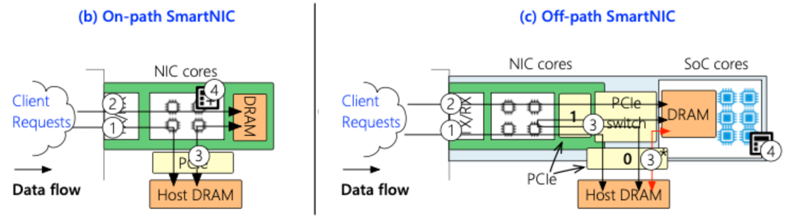

## Abstract
- "what problem is this work trying to tackle?"
- "how new is this effort?" (소개, 개요)

Our blog post will focus on optimizing the serving of large-scale language models in distributed systems, with an emphasis on improving memory efficiency and reducing latency.

#### System architecture aspect

#### Network aspect
대규모 언어 모델(LLM)을 비롯한 딥러닝 모델의 크기가 점점 커지면서, 단일 GPU만으로는 학습을 수행하는 데 한계가 존재하게 되었다. 이에 따라 여러 GPU를 활용하는 **Distributed Deep Learning**(DDL)이 주목받고 있다. DDL은 모델을 여러 HW 장치에 걸쳐 병렬로 학습시킬 수 있는 장점을 제공하지만, 그 과정에서 장치간 Communication Overhead라는 중요한 문제가 발생한다.
특히 **inter-node communication**(GPU-GPU)은 NVIDIA의 NCCL(NVIDIA Collective Communication Library)과 같은 고성능 통신 라이브러리를 통해 효율적으로 처리할 수 있지만, **intra-node communication**(GPU system - GPU system)은 이더넷 장비를 통해 이루어지기 때문에 물리적인 대역폭과 지연 시간의 한계에 직면하게 된다.
이러한 한계를 극복하기 위한 방법으로 SmartNIC과 같은 지능형 네트워크 인터페이스 카드의 활용이 주목받고 있으며, 본 블로그에서는 ***최신 연구를 기반으로 system node간 communication overhead를 SmartNIC을 활용하여 optimizing할 수 있는 관점을 제시***한다.

또한 Communication뿐만 아니라 ~.

최종 정리
따라서 우리 블로그에서는 ~~~

## Background

### Distributed Deep Learning

딥러닝 모델의 규모가 커짐에 따라 단일 GPU의 메모리나 연산 자원만으로는 대규모 모델 학습을 감당하기 어려워졌다. 이러한 문제를 해결하기 위한 방법 중 하나가 **Distributed Deep Learning**(DDL)이다. DDL은 여러 개의 GPU 혹은 노드에 걸쳐 모델 파라미터나 데이터를 분산시켜 병렬로 학습을 수행하는 방식이다. 크게 Data Parallelism과 Model Parallelism로 나뉘며, 최근에는 하이브리드 형태도 널리 활용되고 있다. 
   - **Data Parallelism**은 학습해야 할 data가 많은 경우 여러 GPU에 data를 분산시켜 모델을 학습할 수 있도록 나온 학습 방법이다. 다만 동일한 모델에 대해 각 GPU는 나누어진 data에 대한 weight만을 가지고 있기 때문에 여러 GPU가 학습한 weight parameter를 종합하고 다시 나누는 synchronization 과정이 필요하다. 이후 설명할 Collective Communication이 이때 필요하게 되고 inter-node communication에서 communication overhead가 더 심해지게 된다.
   - **Model Parallelism**은 학습을 진행할 모델의 크기가 너무 커서 모델을 여러 GPU에 분할하여 학습하는 방법이다. Model Parallelism을 구현하는 방법에는 크게 1) Tensor Parallelism, 2) Pipeline Parallelism 2가지가 존재한다. Model Parallism의 경우에도 synchronization overhead가 존재하는데 이는 Data Parallelism에 비해 빈도가 높아지게 된다. 그 이유는 모델 자체를 분할해서 GPU가 연산한 결과를 중간 중간 synchronize 해 주어야 하기 때문이다.

   이렇듯 Distributed Deep Learning은 전체 학습 시간을 단축하고 더 큰 모델을 다룰 수 있도록 해주지만, synchronization이라는 process가 무조건 수행되어야 하기 때문에 GPU 간 communication overhead이라는 새로운 문제를 야기할 수 있다. 만약 model, data의 크기가 더욱 커져서 더 많은 GPU system이 필요로 된다면 communication overhead는 더욱 커질 것이다.

### Intra-node & Inter-node Communication

분산 학습에서는 여러 GPU 간의 협력이 필수적이며, 이 과정에서 두 가지 수준의 통신이 발생한다. **Intra-node communication**은 하나의 서버 내에서 GPU 간에 발생하는 통신을 의미하며, 이는 고속 인터커넥트(NVLink 등)와 라이브러리(NCCL 등)를 통해 상대적으로 빠르게 처리할 수 있다. 반면, **Inter-node communication**은 서로 다른 서버 간의 통신을 의미하며, 일반적으로 이더넷(Ethernet)이나 InfiniBand 같은 네트워크를 통해 이루어진다. 이 경우 네트워크 대역폭과 지연(latency)의 제약으로 인해 성능 저하가 발생할 수 있다. 특히 앞서 설명했듯이 학습 중 반복적으로 발생하는 parameter synchronization 작업은 GPU-GPU communication overhead의 주요 원인이 되고 특히 inter-node communication에서 overhead가 더욱 커질 것이다.

### Collective Communication
DDL에서 모델의 parameter를 synchronize하거나 data를 효율적으로 분산/수집하기 위해서는 **Collective Communication**이 필수적이다. 이는 여러 Process나 GPU간 data를 교환하거나 결합하는 communication pattern을 의미하며, 주로 다음과 같은 유형으로 구분된다.

* **1:N communication** pattern
  * Broadcast : 하나의 node가 가지고 있는 data를 모든 node로 전송한다.
  * Scatter : 하나의 node가 가지고 있는 data를 여러 조각으로 나눠 각 node에 분배한다.
  * Gather : 여러 node의 data를 모아 하나의 node로 수집한다.
  * Reduce : 여러 node의 data를 특정 연산(e.g., sum) 을 통해 하나의 결과로 합쳐서 하나의 node에 전달한다.
* **N:N communication** pattern
  * AllGather : 모든 node끼리 data를 공유하여 최종적으로 모든 node각 전체 data를 보유한다.
  * AllReduce : 모든 node의 data를 연산한 결과를 모든 node 다시 분산한다.

### SmartNIC
Network Interface Card(NIC)은 system을 network에 연결하여 통신하기 위해 사용하는 HW device이다. 기존 NIC은 복잡한 연산은 수행하지 못하고 간단한 network관련 operation을 수행하거나 network packet을 받아서 host CPU로 보내주는 등의 역할을 수행하였다. 하지만 SmartNIC은 기존 NIC device에 core를 탑재하여 조금 더 general purpose한 목적으로 사용할 수 있는 ethernet device이다. 따라서 SmartNIC을 활용한 최신 연구에서는 주로 task를 offloading하여 host CPU의 부담을 줄이면서 communication도 효율적으로 할 수 있도록 한다.   

[Figure -> reference paer]   
SmartNIC은 크게 On-path / Off-path 2가지로 분류된다.
  * **On-path SmartNIC**은 NIC core 자체를 programmable하도록 구현된 장치이다. Network operation이외에도 다양한 연산들을 offload받아서 NIC core 자체에서 처리할 수 있다. 하지만 heavy한 연산들을 많이 처리하다보면 network 처리가 늦어질 수 있다는 단점이 존재한다. 또한 NIC core를 사용하기 위한 programming의 복잡도가 매우 높다.
  * **Off-path SmartNIC**은 On-path와는 달리 NIC core와 별도로 core를 두는 방식이다. 별도의 compute core에서 연산을 처리할 수 있기 때문에 network 성능에는 영향을 미치지 않는다. 다만 compute core 및 memory에 접근하기 위한 communication overhead가 존재하는데 programmer가 사용하기에 훨씬 편하다는 장점이 존재해서 대부분의 연구가 Off-path SmartNIC을 사용한다.

따라서 블로그에서도 주로 Off-path SmartNIC을 다루는 논문들을 다룰 것이며 앞서 제시한 문제들을 해결하기 위해 어떻게 활용할 수 있는 지 알아보고자 한다.

## Main 설명 (제목 바꿀 것, 여러개 있어도됨)
- "what contributions did this work make, and what impact should this work have?"
- "how new is this effort?"

[Network관련]   
[Collective Communication관련 문제를 SmartNIC으로 해결하는 work들]

[Collective Communication 이외에도 발생할 수 있는 문제를 해결하는 work]   
다만 이 논문의 한계는 명확함, Accelerator utilization을 고려한다는데 LLM같은 큰 모델에 대해서는 얘기 안하는 듯

## Results (논문 실험결과 담아도되고 안담아도 되고..)
- "what are the limitations of this work?"
## Conclusion
- 어떤 노력이 있었으며, 어떤식으로 최적화할 것인가?

## Citation (bibs 로 올릴 것이니까 생각 나는 논문들만 정리해둘것.)

Related Paper :   
[Collective Communication관련] 
- OmNICCL (NAIC'24) : Sparse AllReduce algorithm + SmartNIC offloading
  - OmniReduce (SIGCOMM'21) : 위의 논문의 기반 논문 (?)
- Leveraging SmartNIC for Ring AllReduce offloading (ISPA'24) : Offloading Ring AllReduce to SmartNIC
- Network-Offloaded Bandwidth-Optimal Broadcast and Allgather for Distributed AI (SC'24) : Offloading Collective Communication (AllGather, Broadcast) to SmartNIC   
[다른 거 관련]
- Conspirator (ATC'24) : Allevating CPU bottleneck & accelerator scheduling in Distributed ML Workloads by using SmartNIC
- OptimusNIC (EuroMLSys'25) : Offloading optimizer state & Parmeter update to SmartNIC 
