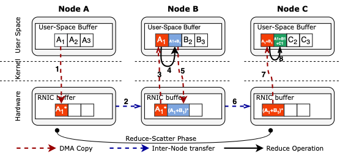
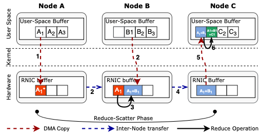
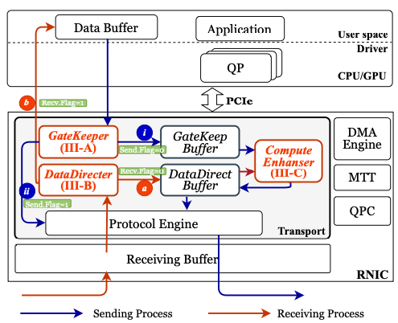
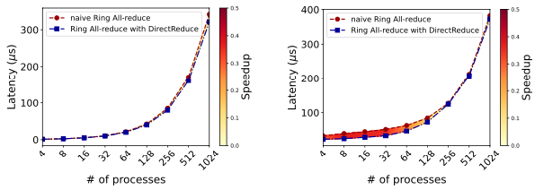
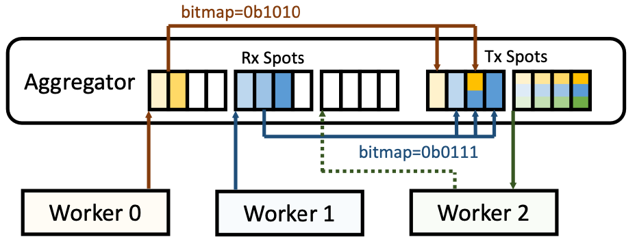

## Abstract
- "what problem is this work trying to tackle?"
- "how new is this effort?" (소개, 개요)

Our blog post will focus on optimizing the serving of large-scale language models in distributed systems, with an emphasis on improving memory efficiency and reducing latency.

#### System architecture aspect

#### Network aspect
대규모 언어 모델(LLM)을 비롯한 딥러닝 모델의 크기가 점점 커지면서, 단일 GPU만으로는 학습을 수행하는 데 한계가 존재하게 되었다. 이에 따라 여러 GPU를 활용하는 **Distributed Deep Learning**(DDL)이 주목받고 있다. DDL은 모델을 여러 HW 장치에 걸쳐 병렬로 학습시킬 수 있는 장점을 제공하지만, 그 과정에서 장치간 Communication Overhead라는 중요한 문제가 발생한다.
특히 **inter-node communication**(GPU-GPU)은 NVIDIA의 NCCL(NVIDIA Collective Communication Library)과 같은 고성능 통신 라이브러리를 통해 효율적으로 처리할 수 있지만, **intra-node communication**(GPU system - GPU system)은 이더넷 장비를 통해 이루어지기 때문에 물리적인 대역폭과 지연 시간의 한계에 직면하게 된다.
이러한 한계를 극복하기 위한 방법으로 SmartNIC과 같은 지능형 네트워크 인터페이스 카드의 활용이 주목받고 있으며, 본 블로그에서는 ***최신 연구를 기반으로 system node간 communication overhead를 SmartNIC을 활용하여 optimizing할 수 있는 관점을 제시***한다.

최종 정리
따라서 우리 블로그에서는 ~~~

## Background

### Distributed Deep Learning

딥러닝 모델의 규모가 커짐에 따라 단일 GPU의 메모리나 연산 자원만으로는 대규모 모델 학습을 감당하기 어려워졌다. 이러한 문제를 해결하기 위한 방법 중 하나가 **Distributed Deep Learning**(DDL)이다. DDL은 여러 개의 GPU 혹은 노드에 걸쳐 모델 파라미터나 데이터를 분산시켜 병렬로 학습을 수행하는 방식이다. 크게 Data Parallelism과 Model Parallelism로 나뉘며, 최근에는 하이브리드 형태도 널리 활용되고 있다. 

   - **Data Parallelism**은 학습해야 할 data가 많은 경우 여러 GPU에 data를 분산시켜 모델을 학습할 수 있도록 나온 학습 방법이다. 다만 동일한 모델에 대해 각 GPU는 나누어진 data에 대한 weight만을 가지고 있기 때문에 여러 GPU가 학습한 weight parameter를 종합하고 다시 나누는 synchronization 과정이 필요하다. 이후 설명할 Collective Communication이 이때 필요하게 되고 inter-node communication에서 communication overhead가 더 심해지게 된다.
   - **Model Parallelism**은 학습을 진행할 모델의 크기가 너무 커서 모델을 여러 GPU에 분할하여 학습하는 방법이다. Model Parallelism을 구현하는 방법에는 크게 1) Tensor Parallelism, 2) Pipeline Parallelism 2가지가 존재한다. Model Parallism의 경우에도 synchronization overhead가 존재하는데 이는 Data Parallelism에 비해 빈도가 높아지게 된다. 그 이유는 모델 자체를 분할해서 GPU가 연산한 결과를 중간 중간 synchronize 해 주어야 하기 때문이다.

   이렇듯 Distributed Deep Learning은 전체 학습 시간을 단축하고 더 큰 모델을 다룰 수 있도록 해주지만, synchronization이라는 process가 무조건 수행되어야 하기 때문에 GPU 간 communication overhead이라는 새로운 문제를 야기할 수 있다. 만약 model, data의 크기가 더욱 커져서 더 많은 GPU system이 필요로 된다면 communication overhead는 더욱 커질 것이다.

### Intra-node & Inter-node Communication

분산 학습에서는 여러 GPU 간의 협력이 필수적이며, 이 과정에서 두 가지 수준의 통신이 발생한다. **Intra-node communication**은 하나의 서버 내에서 GPU 간에 발생하는 통신을 의미하며, 이는 고속 인터커넥트(NVLink 등)와 라이브러리(NCCL 등)를 통해 상대적으로 빠르게 처리할 수 있다. 반면, **Inter-node communication**은 서로 다른 서버 간의 통신을 의미하며, 일반적으로 이더넷(Ethernet)이나 InfiniBand 같은 네트워크를 통해 이루어진다. 이 경우 네트워크 대역폭과 지연(latency)의 제약으로 인해 성능 저하가 발생할 수 있다. 특히 앞서 설명했듯이 학습 중 반복적으로 발생하는 parameter synchronization 작업은 GPU-GPU communication overhead의 주요 원인이 되고 특히 inter-node communication에서 overhead가 더욱 커질 것이다.

### Collective Communication
DDL에서 모델의 parameter를 synchronize하거나 data를 효율적으로 분산/수집하기 위해서는 **Collective Communication**이 필수적이다. 이는 여러 Process나 GPU간 data를 교환하거나 결합하는 communication pattern을 의미하며, 주로 다음과 같은 유형으로 구분된다.

* **1:N communication** pattern
  * Broadcast : 하나의 node가 가지고 있는 data를 모든 node로 전송한다.
  * Scatter : 하나의 node가 가지고 있는 data를 여러 조각으로 나눠 각 node에 분배한다.
  * Gather : 여러 node의 data를 모아 하나의 node로 수집한다.
  * Reduce : 여러 node의 data를 특정 연산(e.g., sum) 을 통해 하나의 결과로 합쳐서 하나의 node에 전달한다.
* **N:N communication** pattern
  * AllGather : 모든 node끼리 data를 공유하여 최종적으로 모든 node각 전체 data를 보유한다.
  * AllReduce : 모든 node의 data를 연산한 결과를 모든 node 다시 분산한다.

### SmartNIC
Network Interface Card(NIC)은 system을 network에 연결하여 통신하기 위해 사용하는 HW device이다. 기존 NIC은 복잡한 연산은 수행하지 못하고 간단한 network관련 operation을 수행하거나 network packet을 받아서 host CPU로 보내주는 등의 역할을 수행하였다. 하지만 SmartNIC은 기존 NIC device에 core를 탑재하여 조금 더 general purpose한 목적으로 사용할 수 있는 ethernet device이다. 따라서 SmartNIC을 활용한 최신 연구에서는 주로 task를 offloading하여 host CPU의 부담을 줄이면서 communication도 효율적으로 할 수 있도록 한다.   
   
SmartNIC은 크게 On-path / Off-path 2가지로 분류된다.
  * **On-path SmartNIC**은 NIC core 자체를 programmable하도록 구현된 장치이다. Network operation이외에도 다양한 연산들을 offload받아서 NIC core 자체에서 처리할 수 있다. 하지만 heavy한 연산들을 많이 처리하다보면 network 처리가 늦어질 수 있다는 단점이 존재한다. 또한 NIC core를 사용하기 위한 programming의 복잡도가 매우 높다.
  * **Off-path SmartNIC**은 On-path와는 달리 NIC core와 별도로 core를 두는 방식이다. 별도의 compute core에서 연산을 처리할 수 있기 때문에 network 성능에는 영향을 미치지 않는다. 다만 compute core 및 memory에 접근하기 위한 communication overhead가 존재하는데 programmer가 사용하기에 훨씬 편하다는 장점이 존재해서 대부분의 연구가 Off-path SmartNIC을 사용한다.

따라서 블로그에서도 주로 Off-path SmartNIC을 다루는 논문들을 다룰 것이며 앞서 제시한 문제들을 해결하기 위해 어떻게 활용할 수 있는 지 알아보고자 한다.

## Main 설명 (제목 바꿀 것, 여러개 있어도됨)
- "what contributions did this work make, and what impact should this work have?"
- "how new is this effort?"
 
### Optimizing inter-node communication with SmartNIC
학습해야 할 모델 크기가 커지고 dataset이 커지고 이에 따라 server system이 대규모로 바뀌면서 자연스레 inter-node communication problem을 지적하고 해결하고자 하는 연구들이 다수 등장하였다. Algoritm SW적으로 해결하고자 하는 방향과 HW acceleration을 통해 해결하고자 하는 방향이 존재한다. 그 중 HW acceleration의 접근 방향이 viable한 approach이고 INA(In Network Aggregation)는 가장 popular한 approach라고 많은 논문에서 소개하고 있다. INA는 network switch를 aggregator로 사용하여 AllReduce와 같은 Collective Communication을 offloading하여 가속하는 방법이다. 하지만 INA는 network switch를 사용하기 때문에 HW resource constraints같은 한계점이 존재한다. 
따라서 밑에서 소개할 논문들은 network switch 대신 SmartNIC이라는 최신 device를 aggregator로 사용한다.
#### SmartNIC for Ring-AllReduce   
>Proposed technique

먼저 Ring-AllReduce를 SmartNIC에 offloading하는 ***DirectReduce***기법을 소개하고자 한다. 논문에서는 다음과 같이 기존 Ring-AllReduce communication의 비효율성을 지적하였다.
   
Figure를 확인해 봤을 때 NIC에서 A1 data를 Node B에 보내주면 Node B에서 reduce연산이 수행되고 result를 다시 NIC에 보내서 Node C로 inter-node communication이 이루어지는 모습을 확인할 수 있다. 여기서 저자들은 만약 A1 data를 Node B로 보내지 않고 B1 data를 NIC으로 가져오는 동작만 수행한 뒤 NIC에서 reduce 연산을 수행하면 효율적이라고 생각하였다. 효율성은 크게 2가지 측면에서 얻을 수 있을 것이다.   
1. Node B는 기존에 수행하던 연산을 방해받지 않고 계속 진행할 수 있다.
2. Node B와 NIC간의 불필요한 communication이 사라진다.

따라서 이를 고려한 communication path는 다음과 같이 구상해 볼 수 있을 것이다.
   
불필요한 data movement가 사라지고 NIC에서 reduce operation을 수행하여 Node B를 방해하지 않는 것을 확인할 수 있다. NIC에서 DMA를 수행하여 data를 가져오기 때문에 host인 Node B는 관여하지 않게되고 수행하던 ML workload를 계속 실행할 수 있다.

앞서 제시한 Communication path를 수행하기 위해 제안하는 architecutre는 다음과 같고 크게 3가지 component를 NIC에 추가한 모습을 볼 수 있다.   
   
* GateKeeper : Ring AllReduce 데이터 전송을 위한 prefetch 관리 및 버퍼 최적화
* DataDirecter : 수신 데이터의 패킷 흐름을 RNIC 내부로 전환시켜 직접 처리
* ComputeEnhancer : FPGA 등을 통해 RNIC에서 reduce 연산을 직접 수행 (SmartNIC)

>Evaluation results

실험은 실제 system에서 많이 사용되는 2가지 network topolgy 환경을 가정하여 진행하였다.
1. Ring topology : 8 nodes   
2. 6D-torus topology :  729, 4096, 46656, and 262144, corresponding to 3, 4, 6, and 8 nodes per dimension
그리고 architecture의 구현은 Xilix Vivado를 이용하고 전체적인 simulation은 Astra-Sim2를 사용하여 진행했다. 

다만 6D-torus topology에 대한 실험 결과는 Ring topology와 매우 비슷한 양상을 띄고 있기 때문에 Ring topology에 대한 실험결과만 소개하도록 하겠다.
* Small message size (1KiB, 256KiB, respectively)
   
  Message size가 작을 때 node의 process 수를 증가시켰을 때 latency를 비교한 그래프이다. computation overhead도 적고 보내야 하는 message size 자체가 작기 때문에 naive Ring-AllReduce와 비교했을 때 latency차이가 크지 않은 모습을 확인할 수 있다.
* Large message size (256MiB, 1GiB, respectively)
   
  반면 message size가 클 때는 reduce operation을 NIC에서 수행하는 이점이 커진다. AI workload를 수행하는 process는 AllReduce에 의한 방해를 받지 않고 result를 빠르게 도출해내며 NIC에서는 result에 대한 reduce operation 처리를 도맡아서 수행하기 때문이다.

결론적으로 논문에서는 실험결과를 통해 다음과 같은 insight를 제공한다. DirectReduce는 중간 크기의 메시지를 처리할 때 Ring AllReduce 대비 향상된 성능을 제공하지만, 그 이점은 메시지 크기 $M$과 프로세스 수 $N$에 따라 달라진다. 특히, 프로세스당 데이터 양 $M/N$이 1KB 이하일 경우에는 성능 차이가 거의 없지만, $M/N > 1\text{KB}$인 경우에는 stream aggregation 기반 파이프라인 덕분에 Ring AllReduce보다 15%에서 36%까지 지연 시간을 줄일 수 있다. 일반적으로 $N$이 많을수록, $M$이 클수록 DirectReduce의 효과는 증가하며, 이는 더 많은 패킷 생성과 병렬 처리를 가능하게 한다. 그러나 메시지 크기 $M$이 1MB보다 작고 $N$이 커질 경우, 전체 패킷 수가 줄어들어(경우에 따라 1개까지) 오히려 파이프라인 효과가 감소하면서 성능 향상에 제약을 줄 수 있다. 이를 표로 정리하면 다음과 같다.
| 조건                       | DirectReduce 성능 향상 효과                       |
|----------------------------|--------------------------------------------------|
| $M/N \leq 1\text{KB}$      | 성능 향상 거의 없음                              |
| $M/N > 1\text{KB}$         | 15% ~ 36% latency 개선                           |
| $N \uparrow$, $M \uparrow$| 패킷 수 및 파이프라인 증가 → 성능 향상 증가     |
| $M < 1\text{MB}$, $N \uparrow$| 패킷 수 감소 → 파이프라인 효과 감소로 성능 이점 제한 |

#### Zero-Sparse AllReduce and SmartNIC offloading
>Proposed technique

다음으로 소개할 논문은 SmartNIC에 offloading하는 것뿐만 아니라 Zero-Sparse AllReduce algorithm도 같이 제안하여 communication 시 이동되는 data 양 자체를 줄이려는 시도를 하고 있다. 다만 이 블로그는 SmartNIC을 활용하는 방안에 더 중점을 맞추고 있으므로 Zero-Sparse algorithm은 간단하게 소개하고 넘어가도록 하겠다.
* **Zero-Sparse AllReduce**
    
저자들은 AllReduce를 수행해야 하는 data(e.g., gradient)에 0이 많이 존재할 경우 0인 data를 communication에 포함시키는 게 매우 비효율적이라고 생각하였다. 특히나 최신 AI model들은 model parameter가 매우 많아서 이를 최적화하기 위해 pruning같은 기법을 사용한다. 이러한 모델들을 sparse neural network라고도 부르는데 이 모델의 특징은 gradient의 많은 부분이 0인 것이다. 따라서 이러한 점을 근거로 AllReduce 시 0인 data는 포함하지 않는게 communication에 효율적이라고 판단할 수 있고 제안하는 Zero-Sparse AllReduce의 동작은 위 그림과 같다. 단순하게 AllReduce에 사용할 gradient vector가 있다고 할 때 이를 block 단위로 나누고 block 중 0인 data만을 포함하는 zero-block은 AllReduce communication 대상에서 제외한다. 따라서 communication 시 data movement가 줄어들어 latency가 감소할 것이라고 기대할 수 있다. 

* **Using SmartNIC as aggregator**

다음은 SmartNIC을 aggregator로 사용하는 방법이다. 저자들은 SmartNIC의 memory bandwidth한계를 지적하고 이를 해결하기 위해 DCA(Direct Cache Access)를 사용해서 NIC이 LLC에 직접 접근하는 방법을 사용한다. 하지만 여러 node의 data를 aggregate하여 reduce 연산을 수행해야 하는데 LLC의 용량이 한계가 존재하고 이를 해결하기 위해 SmartNIC 내부 memory layout을 위 그림과 같이 제안하였다. 간단하게 동작을 이해해보면 non-zero block을 담아두고 보내는 Rx / Tx Spot이 존재하고 이는 RDMA region이기 때문에 Worker들이 직접 memory write을 수행할 수 있다. Worker들이 Rx Spot에 data를 write해주면 aggergator(SmartNIC)은 Rx Spot에 담긴 data와 index를 확인하고 동일한 위치의 Tx Spot의 data와 reduce 연산을 수행한 뒤 Tx Spot에 결과를 update한다. 이렇게 동작이 수행되면 수많은 Worker의 data를 모두 유지할 필요가 없어지고 LLC를 효율적으로 사용할 수 있다. 추가적으로 Tx Spot이 2개인 것을 그림에서 확인할 수 있는데 이는 double buffering을 사용하기 위함이다. 이전 phase에서 AllReduce의 result를 아직 모든 Worker에 scatter하지 않았는데 다음 phase가 수행되면 Tx Spot의 data가 update되어 버리기 때문이다.

>Evaluation results

실험은 GPU worker로 구성된 system과 CPU Worker로 구성된 system 2가지를 진행하였고 SmartNIC의 경우 NVIDIA Bluefield-2를 사용하였다. 그리고 OSU MPI Microbenchmark와 비슷하게 microbenchmark를 사용하였고 benchmark는 AllReduce benchmarking을 지원한다. 다른 AllReduce benchmark와는 다르게 array의 sparsity를 조절하여 실험할 수 있도록 구성했다고 한다. 이러한 실험 setting을 바탕으로 reduce operation을 수행할 aggregator를 SmartNIC으로 사용했을 때와 host CPU를 사용한 결과를 비교하여 보여주고 있다. 또한 다른 Sparse AllReduce와 비교하여 제안하는 Zero-Sparse AllReduce가 효과적임을 보여주고 있다.

* Comparison of two Sparse AllReduce 
   
실험 결과는 제안하는 Zero-Sparse AllReduce(OmNICCL)와 다른 Sparse AllReduce(OmniReduce)와의 비교 결과이다. 실험결과를 통해 모든 면에서 제안하는 OmNICCL이 OmniReduce보다 좋은 성능을 보임을 주장하고 있다.

* Comparison of two aggregator

실험결과는 message size를 128MB기준으로 Worker의 수를 다르게 하면서 Block Sparsity도 다르게 실험한 결과이다. OmNICCL*은 SmartNIC을 aggregator로 사용했을 때이고 OmNICCL은 SmartNIC을 사용하지 않고 일반적인 CPU를 aggregator로 사용했을 때 실험 결과이다. GPU system에서 Block Sparsity가 25% ~ 75%인 경우 SmartNIC을 사용했을 때 latency가 약간 줄어든 모습을 확인할 수 있다.

### Limited performance of SmartNIC 
DirectReduce와 OmNICCL 모두 SmartNIC의 근본적인 성능과 memory capacity가 크지 않은 점을 지적하고 이를 해결하기 위한 solution을 제공하고 있다. 하지만 실험 결과에서 볼 수 있듯이 특히, OmNICCL의 경우 SmartNIC을 사용할 경우 dramatic한 performance 향상을 보여주고 있지는 않고 이는 여전히 SmartNIC의 HW resource constraints때문이라고 생각한다. 다만 DirectReduce는 성능이 많이 향상되지 않았나?라는 의문이 들 수 있는데, DirectReduce의 경우 FPGA-based로 ASIC한 SmartNIC을 구성하여 Simulation-based로 실험을 진행하였고 OmNICCL의 경우 실제 NVIDIA의 bluefield-2 제품을 사용해서 결과의 차이가 존재할 수 있다. 또한 DirectReduce의 경우 성능 향상이 이루어졌을 때는 더 큰 message를 target하고 있기 때문에 이 부분도 고려하여 결과를 해석해야 한다.
결론적으로 SmartNIC을 활용하기 위한 다양한 연구들이 진행되고 있지만, 아직 SmartNIC 자체의 성능이 그리 좋지 못하기 때문에 대부분의 논문에서 이를 지적하고 최대한의 성능을 이끌어내기 위한 연구가 진행되고 있다. 다만 이 문제는 SmartNIC이 앞으로 더 발전한다면 자연스레 해결될 수 있는 문제라고 생각한다.

## Conclusion
- 어떤 노력이 있었으며, 어떤식으로 최적화할 것인가?
- Project Proposal 참고해서 전체적인 Conclusion으로 작성할 것

본 blog post에서는 model parameter 및 data size가 큰 최신 AI trend에서 학습/추론에 대해 2가지 측면에서 최적화할 수 있는 여러 연구들을 살펴보았다.

또한, 연산 구조뿐만 아니라 서버 시스템 간 통신에서 발생하는 병목 현상을 줄이기 위한 네트워크 측면의 최적화 기법들에 대한 연구도 함께 살펴보았다.   
최근 인공지능 모델 학습을 할때 GPU 1개로는 부족해서 여러 GPU가 하나의 node에 묶인 GPU system을 사용할뿐만 아니라 이러한 GPU system을 여러 개 사용해야 할 정도로 모델이 크고 복잡해졌다. 하지만 multi-GPU system을 사용할 경우 연산 측면에서는 빨라지지만 이에 따라 system간 parameter교환 등 communication이 많이 발생한다. 따라서 System간 communication overhead를 최적화하기 위해서 여러 연구에서 SmartNIC을 활용하려는 시도가 많아지고 있다. 
* **DirectReduce**에서는 기존 Ring AllReduce communication operation을 SmartNIC에 offloading하여 CPU/GPU가 온전히 AI operation만 수행해서 문제를 해결하고자 하였다.
* **OmNICCL**에서는 Zero-Sparse AllReduce algorithm을 제안하여 communication할 때 data movement를 줄이고 communication operation도 SmartNIC에 offloading하여 문제를 해결하고자 하였다.

하지만 앞서 소개했듯이 아직 SmartNIC에서 무겁고 복잡한 연산을 수행하기에는 성능이 뛰어나지 못하다. 또한 memory 용량도 당연히 CPU에 비하면 많이 부족한 수준이기 때문에 data-sensitive한 workload를 offloading해서 수행하기에도 한계점이 존재한다. 하지만 앞으로 기술이 발전하면서 SmartNIC architecture도 더 좋은 성능을 가지도록 개발된다면 SmartNIC의 활용도는 무궁무진할 것이다. 

결론적으로 ~~~~

## Related work
Collective Communication이외에도 server system에서 SmartNIC을 통해 다양한 operation을 최적화 하려는 연구가 많이 진행되고 있다. 
> RPC layer offloading   

**RpcNIC**은

> Storage request offloading

**SmartDS**는 

## Citation (bibs 로 올릴 것이니까 생각 나는 논문들만 정리해둘것.)
[pool] -> (0 ~ 10)   
[nic] -> (11 ~ 20)

Related Paper :   
[Collective Communication관련] 
- OmNICCL (NAIC'24) : Sparse AllReduce algorithm + SmartNIC offloading
  - OmniReduce (SIGCOMM'21) : 위의 논문의 기반 논문 (?)
- Leveraging SmartNIC for Ring AllReduce offloading (ISPA'24) : Offloading Ring AllReduce to SmartNIC
- FPGA-Based AI Smart NICs for Scalable Distributed AI Training Systems (IEEE CAL'22)

Reference :    
Charaterizing Off-path SmartNIC for Accelerating Distributed Systems
Nvidia. 2023. Nvidia BlueField-2 DPU. https://www.nvidia.com/content/dam/en-
zz/Solutions/Data-Center/documents/datasheet-nvidia-bluefield-2-dpu.pdf

Background 관련 Reference
https://frankdenneman.nl/2020/02/19/multi-gpu-and-distributed-deep-learning/
https://en.wikipedia.org/wiki/Collective_operation