## Abstract
- "what problem is this work trying to tackle?"
- "how new is this effort?" (소개, 개요)

Our blog post will focus on optimizing the serving of large-scale language models in distributed systems, with an emphasis on improving memory efficiency and reducing latency.

#### System architecture aspect

#### Network aspect
As deep learning models—including large language models (LLMs)—continue to grow in scale, it has become increasingly difficult to train them on a single GPU. This has led to a growing interest in **Distributed Deep Learning** (DDL), which enables models to be trained in parallel across multiple hardware devices. While DDL offers clear advantages in scalability, it also introduces a critical challenge: communication overhead between devices. In particular, **inter-node communication** (GPU-to-GPU) can be handled efficiently using high-performance communication libraries such as NVIDIA’s NCCL (NVIDIA Collective Communication Library). However, **intra-node communication** (between GPU systems) often relies on Ethernet-based connections, which are inherently limited by physical bandwidth and latency constraints.
To address these limitations, intelligent network interface cards (SmartNICs) have emerged as a promising solution<d-cite key="OmNICCL, DirectReduce, FPGANIC, OptimusNIC, SqueezeNIC"></d-cite>. In this blog post, we explore ***how recent research suggests that SmartNICs can be leveraged to optimize communication overhead between system nodes in distributed deep learning environments***.

최종 정리
따라서 우리 블로그에서는 ~~~

## Background

### Distributed Deep Learning
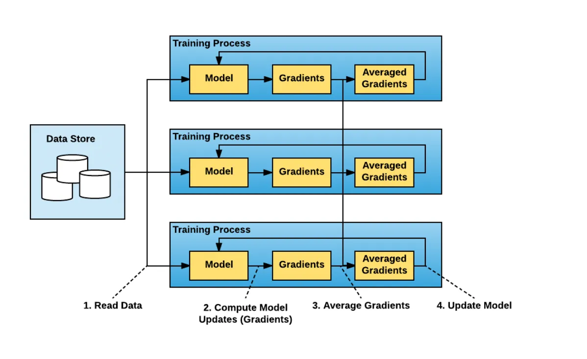
As deep learning models continue to grow in size, it has become increasingly difficult to train large-scale models using only the memory and compute resources of a single GPU. One of the key approaches to overcoming this limitation is **Distributed Deep Learning** (DDL). DDL distributes model parameters or data across multiple GPUs or nodes, enabling parallel training. It is generally categorized into **Data Parallelism** and **Model Parallelism**<d-cite key="denneman2020multiGPU"></d-cite>.
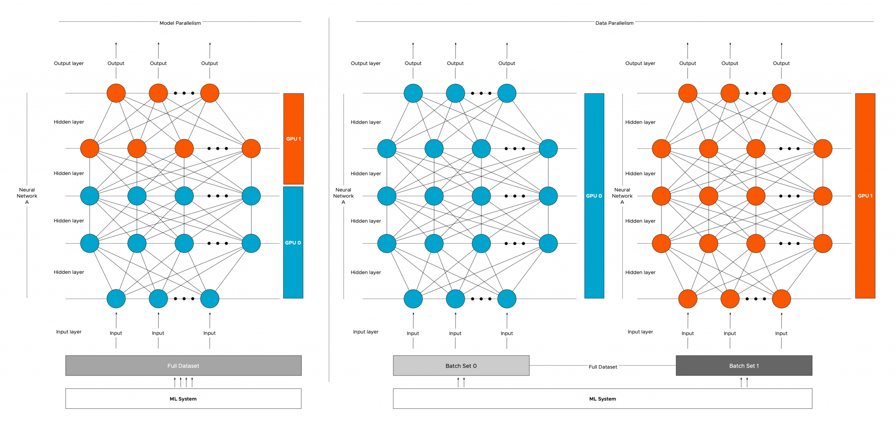
   - **Data Parallelism** is a training method designed for scenarios where a large volume of data needs to be processed. It distributes the dataset across multiple GPUs, allowing each GPU to train the same model on a different subset of the data. However, since each GPU only updates the weights based on its local data, a **synchronization** step is required to aggregate and redistribute the updated weight parameters. This is where **Collective Communication** becomes essential, and as we will discuss later, it can lead to increased communication overhead—particularly in inter-node communication.
   - **Model Parallelism** is a training approach used when the model itself is too large to fit on a single GPU. In this method, the model is divided and distributed across multiple GPUs. There are two main techniques for implementing Model Parallelism: (1) **Tensor Parallelism** and (2) **Pipeline Parallelism**. Synchronization overhead also exists in Model Parallelism, and it tends to occur more frequently than in Data Parallelism. This is because the model is partitioned, requiring GPUs to synchronize their intermediate computation results during training.

   While Distributed Deep Learning enables faster training and the ability to handle larger models, it inherently requires a synchronization process, which introduces a new challenge: communication overhead between GPUs. As the size of the model and dataset continues to grow, requiring more GPU systems to work together, this communication overhead is expected to increase even further.

### Intra-node & Inter-node Communication
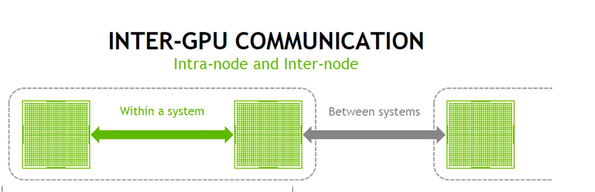
In distributed training, cooperation among multiple GPUs is essential, and this involves two levels of communication. **intra-node communication** refers to communication between GPUs within a single server, which can typically be handled efficiently using high-speed interconnects such as NVLink and libraries like NCCL. In contrast, **inter-node communication** refers to communication between GPUs across different servers, which usually takes place over networks such as Ethernet or InfiniBand. In this case, limitations in network bandwidth and latency can lead to performance degradation. As mentioned earlier, parameter synchronization—performed repeatedly during training—is a major source of GPU-to-GPU communication overhead, and this overhead tends to be more severe in inter-node communication.

### Collective Communication
In DDL, **Collective Communication** is essential for synchronizing model parameters and efficiently distributing or aggregating data. This refers to communication patterns that involve exchanging or combining data across multiple processes or GPUs. These patterns are typically categorized into several common types, as outlined below<d-cite key="wikiCollectiveOp"></d-cite>.   
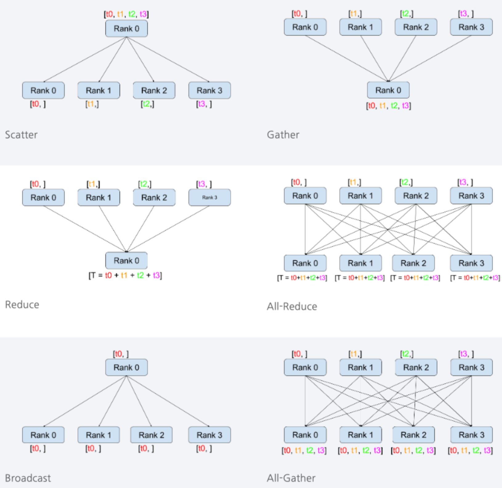
* **1:N communication** pattern
    * Broadcast: Sends data from a single node to all other nodes.
	* Scatter: Splits data on one node into multiple parts and distributes them to other nodes.
	* Gather: Collects data from multiple nodes and aggregates it on a single node.
	* Reduce: Combines data from multiple nodes using a specified operation (e.g., sum) and delivers the result to a single node.
* **N:N communication** pattern
    * AllGather: Each node shares its data with all other nodes, resulting in every node holding the complete set of data.
    * AllReduce: Data from all nodes is combined using a specified operation (e.g., sum), and the result is distributed back to all nodes.

### SmartNIC
A **Network Interface Card** (NIC) is a hardware device used to connect a system to a network and enable communication. Traditional NICs are limited in functionality—they typically handle simple network-related operations or forward incoming packets to the host CPU. In contrast, a SmartNIC is an enhanced Ethernet device equipped with onboard processing cores, allowing it to support more general-purpose tasks. Recent research leveraging SmartNICs often focuses on offloading certain tasks from the host CPU, thereby reducing its workload and enabling more efficient communication.   
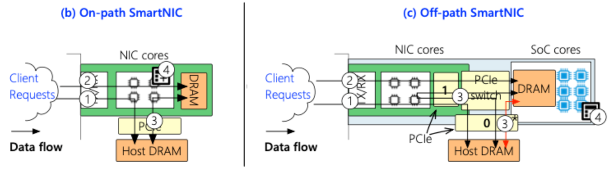   
SmartNICs are generally classified into two types: on-path and off-path.
* **On-path SmartNICs** are designed with programmable NIC cores, allowing them to handle not only basic network operations but also various offloaded computations directly within the NIC itself. While this approach offers flexibility, it has potential drawbacks—heavy computational loads can delay network packet processing, and programming the NIC cores tends to be highly complex.
* **Off-path SmartNICs**, on the other hand, include separate compute cores that are distinct from the main NIC cores. This design allows offloaded tasks to be processed without interfering with network performance. Although there is some communication overhead when accessing memory and compute resources, off-path SmartNICs are generally more programmer-friendly. As a result, they are more commonly adopted in recent research.

In this blog, we will primarily focus on studies utilizing off-path SmartNICs and explore how they can be leveraged to address the communication challenges outlined earlier.

## Various techniques for efficient serving system
- "what contributions did this work make, and what impact should this work have?"
- "how new is this effort?"
 
### Optimizing inter-node communication with SmartNIC
As model sizes and datasets continue to grow, and as server systems scale accordingly, many research efforts have emerged to identify and address the resulting inter-node communication challenges. These efforts generally take two directions: one focusing on algorithmic or software-level solutions, and the other on hardware acceleration. Among these, hardware-based acceleration is increasingly viewed as a viable approach, with In-Network Aggregation (INA) being one of the most popular methods cited across recent studies.   
Traditional INA techniques utilize network switches as aggregators to offload and accelerate collective communication operations such as AllReduce. However, despite their potential, network switches are not well-suited for high-performance computing (HPC) environments<d-cite key="DirectReduce"></d-cite>.   
Therefore, the papers introduced below explore ***the use of SmartNICs—modern programmable network devices—as aggregators instead of traditional network switches***.
#### SmartNIC for Ring-AllReduce   
>Proposed technique

We begin by introducing ***DirectReduce***<d-cite key="DirectReduce"></d-cite>, a technique that offloads Ring-AllReduce operations onto SmartNICs. The paper highlights several inefficiencies in the traditional Ring-AllReduce communication pattern, as outlined below.   
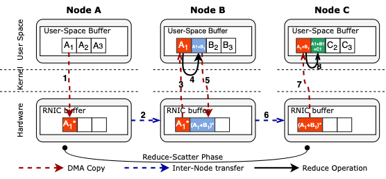   
Based on the figure, we can observe that when the NIC sends A1 data to Node B, the reduction operation is performed on Node B, and the result is then returned to the NIC to continue inter-node communication with Node C. The authors propose an alternative approach: instead of sending A1 data to Node B, only fetching B1 data from Node B to the NIC and performing the reduction directly on the NIC could be more efficient.

This efficiency can be gained from two main perspectives:   
1. Node B can continue its local computations without being interrupted by additional processing.
2. Unnecessary communication between Node B and the NIC is eliminated.

Taking these observations into account, a revised communication path can be envisioned as follows.   
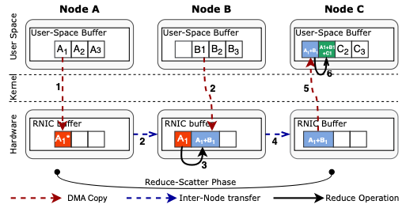   
This approach eliminates unnecessary data movement and enables the reduction operation to be executed directly on the NIC, avoiding interference with Node B. Since the NIC uses DMA to fetch data, the host (Node B) remains uninvolved in the transfer and can continue running its ML workloads without interruption.

To realize the proposed communication path, the authors introduce a new NIC architecture, which includes three key components added to the NIC.   
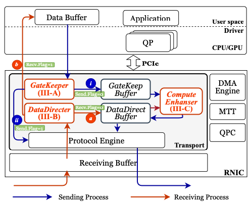   
* GateKeeper: Manages prefetching and buffer optimization for data transfers in the Ring-AllReduce process.
* DataDirector: Redirects incoming data packets into the RNIC’s internal data path for direct handling within the NIC.
* ComputeEnhancer: Performs reduction operations directly on the RNIC using hardware accelerators such as FPGAs, enabling compute capabilities on the SmartNIC.

>Evaluation results

The experiments were conducted under two network topology configurations that are commonly used in real-world systems:
1. Ring topology: 8 nodes
2. 6D-torus topology: 729, 4,096, 46,656, and 262,144 nodes—corresponding to 3, 4, 6, and 8 nodes per dimension, respectively   

The architecture was implemented using **Xilinx Vivado**, and the overall simulation was carried out using **Astra-Sim2**<d-cite key="AstraSim2"></d-cite>.
However, since the results observed under the 6D-torus topology closely resemble those from the ring topology, we will focus on presenting the experimental results for the ring topology only.
* Small message size (1KiB, 256KiB, respectively)   
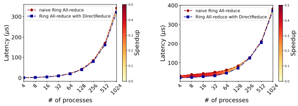   
  The graph compares latency as the number of processes per node increases, specifically in scenarios with small message sizes. Since the computation overhead is low and the messages themselves are small, the latency difference between the proposed approach and naive Ring-AllReduce remains minimal.
* Large message size (256MiB, 1GiB, respectively)   
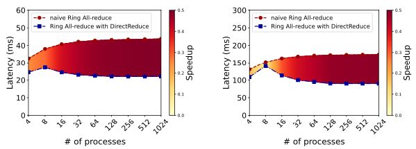   
  In contrast, for larger message sizes, the benefit of performing the reduce operation on the NIC becomes more significant. Processes running AI workloads can produce results without being interrupted by AllReduce operations, while the NIC takes full responsibility for handling the reduction of those results.

In conclusion, the paper presents the following key insight based on the experimental results: while DirectReduce offers improved performance over traditional Ring AllReduce when handling medium-sized messages, the actual benefit depends on both the message size ($M$) and the number of processes ($N$).   
Specifically, when the amount of data per process ($M/N$) is less than or equal to 1KB, there is little to no performance gain. However, when $M/N > 1\text{KB}$, the stream aggregation-based pipeline allows DirectReduce to reduce latency by 15% to 36% compared to Ring AllReduce. In general, the performance advantage of DirectReduce increases with larger $M$ and greater $N$, as this leads to the generation of more packets and enables more parallelism.   
That said, when the message size $M$ is smaller than 1MB and $N$ becomes large, the total number of packets may decrease (sometimes down to just one), which in turn limits the effectiveness of the pipeline and constrains performance improvement.

The findings can be summarized in the following table.
| Condition                            | Performance Benefit of DirectReduce                          |
|--------------------------------------|--------------------------------------------------------------|
| $M/N \leq 1\text{KB}$                | Little to no performance improvement                        |
| $M/N > 1\text{KB}$                   | 15%–36% latency reduction                                    |
| $N \uparrow$, $M \uparrow$          | More packets and deeper pipeline → greater performance gain  |
| $M < 1\text{MB}$, $N \uparrow$       | Fewer packets → limited pipeline effect, reduced benefit     |

#### Zero-Sparse AllReduce and SmartNIC offloading
>Proposed technique

The next paper, OmNICCL<d-cite key="OmNICCL"></d-cite>, introduces not only an offloading mechanism to SmartNICs but also proposes a Zero-Sparse AllReduce algorithm, which aims to reduce the overall amount of data transferred during communication. However, since this blog focuses primarily on SmartNIC-based solutions, we will briefly introduce the Zero-Sparse algorithm and then shift our attention back to the SmartNIC-related aspects.
* **Zero-Sparse AllReduce**
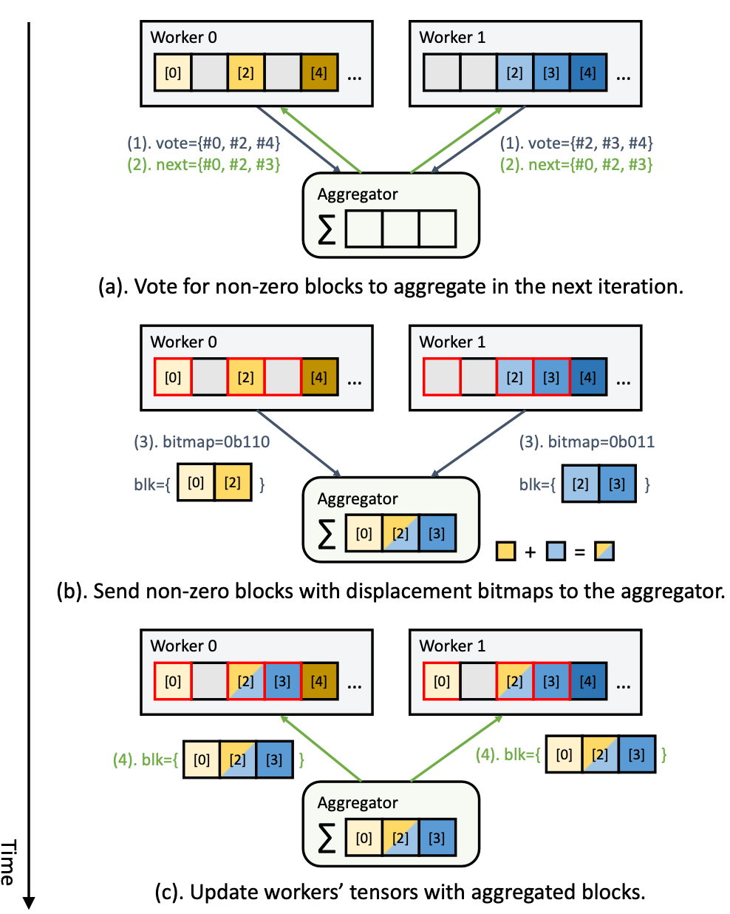    
The authors observed that when performing AllReduce on data such as gradients, it is highly inefficient to include a large number of zero values in the communication. This issue becomes more prominent in modern AI models, which often contain a vast number of parameters. To optimize these models, techniques like pruning are frequently applied, resulting in what are known as sparse neural networks—models in which a significant portion of the gradients are zero.   
Based on this observation, the authors argue that excluding zero values during AllReduce can lead to more efficient communication. The proposed Zero-Sparse AllReduce algorithm operates as illustrated in the figure above. In simple terms, the gradient vector used for AllReduce is divided into blocks. Any block that contains only zeros (a zero block) is excluded from the communication process. As a result, the amount of data transferred is reduced, leading to lower communication latency.

* **Using SmartNIC as aggregator**
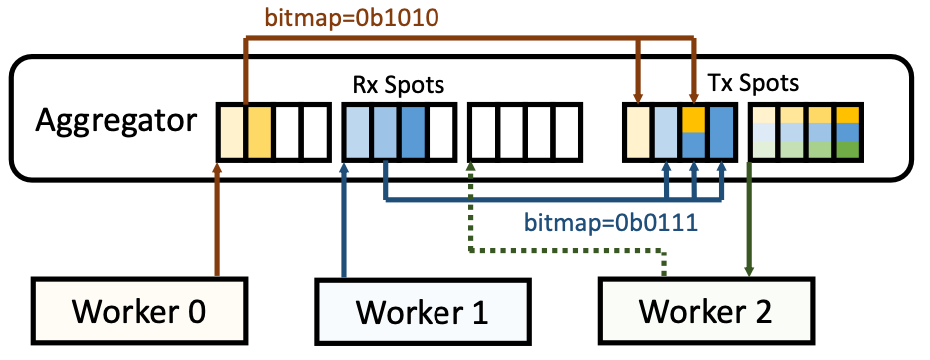
The next approach focuses on using SmartNICs as aggregators. The authors highlight the limitation of memory bandwidth on SmartNICs and propose a solution using **Direct Cache Access** (DCA), which allows the NIC to directly access the Last-Level Cache (LLC). However, since the NIC must aggregate data from multiple nodes to perform reduction operations, the limited capacity of the LLC becomes a bottleneck. To address this, the authors propose a specialized memory layout inside the SmartNIC, as shown in the figure above.   
In simple terms, the design introduces Rx and Tx Spots to store non-zero blocks. These spots reside in RDMA-accessible regions, allowing worker nodes to write data directly into them. When a worker writes data to an Rx Spot, the aggregator (SmartNIC) reads the data and its corresponding index, performs a reduction with the existing data in the corresponding Tx Spot, and updates the Tx Spot with the result.   
This approach eliminates the need to store all incoming data from every worker, allowing more efficient use of LLC. Additionally, the figure shows two Tx Spots, which are used for double buffering. This mechanism prevents overwriting Tx data that has not yet been scattered to all workers from the previous AllReduce phase when the next phase begins.

>Evaluation results

The experiments were conducted on two types of systems: one with GPU workers and another with CPU workers. For the SmartNIC, the authors used the **NVIDIA BlueField-2**<d-cite key="bluefield2"></d-cite>. A custom microbenchmark, similar in spirit to the OSU MPI Microbenchmark suite, was used to evaluate AllReduce performance. Unlike typical AllReduce benchmarks, this version allows for configurable array sparsity, enabling more nuanced experimentation.   
Using this setup, the authors compare the performance of executing the reduction operation on a SmartNIC versus on a host CPU. Their results demonstrate that SmartNIC-based aggregation is more efficient. Furthermore, when compared against other sparse AllReduce method<d-cite key="OmniReduce"></d-cite>, the proposed Zero-Sparse AllReduce approach shows clear advantages in performance.

* Comparison of two Sparse AllReduce 
   
The experimental results compare the proposed Zero-Sparse AllReduce method, OmNICCL, against an existing sparse AllReduce technique, OmniReduce. The authors claim that OmNICCL consistently outperforms OmniReduce across all evaluated scenarios.

* Comparison of two aggregator
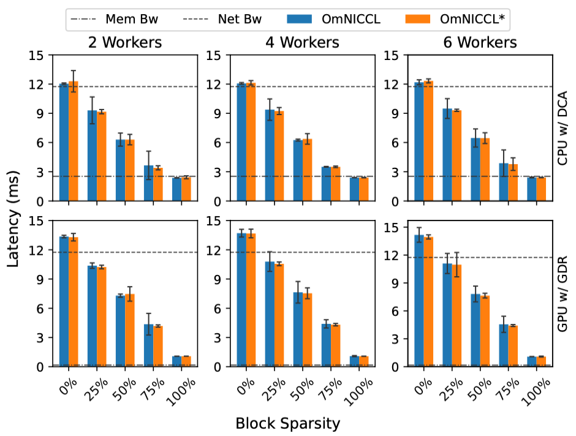
The experiments were conducted by varying the number of workers and block sparsity levels, with a fixed message size of 128MB. Two versions of OmNICCL are presented: OmNICCL* refers to the setup where a SmartNIC is used as the aggregator, while OmNICCL refers to the case where a conventional CPU serves as the aggregator. In GPU-based systems, when the block sparsity ranges from 25% to 75%, OmNICCL* shows a modest reduction in latency compared to the CPU-based version, highlighting the benefit of SmartNIC offloading in sparse communication scenarios.

### Limitation of SmartNIC 
Both **DirectReduce** and **OmNICCL** identify the fundamental limitations of SmartNICs—namely, their limited performance and memory capacity—and propose architectural solutions to address these constraints. However, as seen in the experimental results, especially in the case of OmNICCL, the use of SmartNICs does not lead to dramatic performance improvements. This is likely due to the current hardware resource constraints of commercially available SmartNICs.   
One might wonder why DirectReduce appears to achieve more substantial performance gains. This can be attributed to the fact that DirectReduce was evaluated using a simulation-based setup with an FPGA-based, ASIC-style SmartNIC, while OmNICCL was tested on actual hardware using NVIDIA’s BlueField-2 . The discrepancy in hardware platforms may explain the difference in results. Additionally, DirectReduce focuses on larger message sizes, which can amplify performance gains—this context should also be considered when interpreting the results.   
In conclusion, while a variety of research<d-cite key="OmNICCL, DirectReduce, OffPath, OptimusNIC, LineFS"></d-cite> efforts are exploring how to best leverage SmartNICs, most studies still point to their limited capabilities as a bottleneck. As such, many works aim to extract the maximum possible performance from current SmartNIC architectures. Nevertheless, this issue is expected to diminish as SmartNIC technology continues to advance in the future.

## Conclusion
- 어떤 노력이 있었으며, 어떤식으로 최적화할 것인가?
- Project Proposal 참고해서 전체적인 Conclusion으로 작성할 것

## Citation (bibs 로 올릴 것이니까 생각 나는 논문들만 정리해둘것.)

